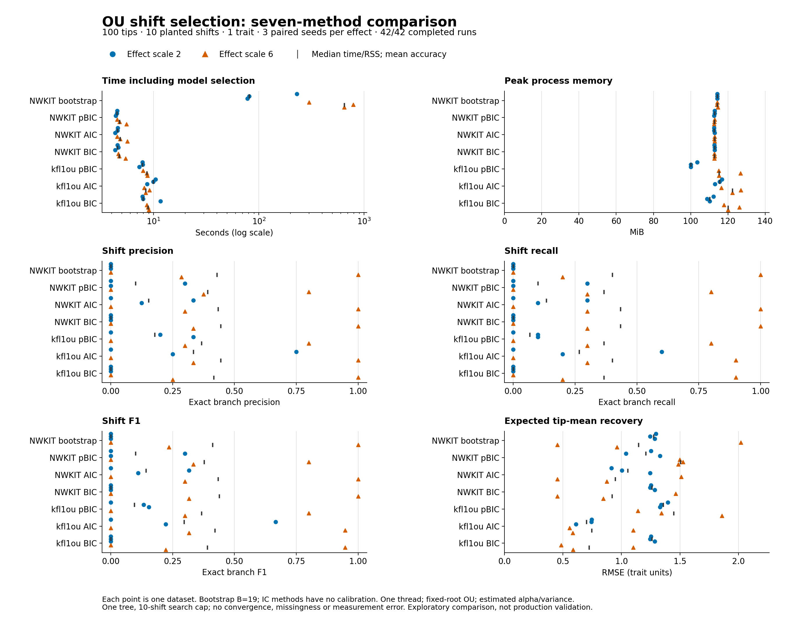

# Measured comparison

Seven configured selection procedures on six paired datasets: 100 tips, ten planted shifts, one trait and three seeds per effect scale. Corrected kfl1ou pBIC passed its capability probe before timing.

Native IC median runtime was 4.5–4.8 seconds, versus 7.8–9.9 seconds for kfl1ou IC. Matching-criterion ratios of median time were 1.75–2.20 in favor of native. Bootstrap medians were 81.1 seconds at effect scale 2 and 647.7 seconds at scale 6. Peak process memory was similar in scale (100–127 MiB across individual runs).

Accuracy varied by method and dataset. At weak effect scale 2, mean exact-branch F1 was 0.296 for kfl1ou AIC and 0.142 for native AIC. At scale 6, native BIC/AIC had mean F1 0.439/0.433 and kfl1ou AIC 0.421, with large differences between seeds. Expected-tip-mean RMSE for kfl1ou AIC was 0.700/0.746 across the two strengths, versus native AIC 1.054/0.946. These small-sample results do not establish a general ranking.

For every dataset, all four native methods evaluated the same 48 candidate layouts with identical likelihoods. The default bootstrap selected exactly the same branches and tip means as the previous implementation; only its timing was measured afresh. [Search and default-behavior audit](validation/native-search-equivalence.json).

| Effect | Method | Complete | Wall median (s) | CPU median (s) | RSS median (MiB) | Precision | Recall | F1 | Mean RMSE |
| --- | --- | --- | --- | --- | --- | --- | --- | --- | --- |
| 2 | NWKIT bootstrap | 3/3 | 81.09 | 81.02 | 114.22 | 0.000 | 0.000 | 0.000 | 1.275 |
| 2 | NWKIT pBIC | 3/3 | 4.46 | 4.41 | 112.82 | 0.100 | 0.100 | 0.100 | 1.207 |
| 2 | NWKIT AIC | 3/3 | 4.52 | 4.49 | 112.57 | 0.153 | 0.133 | 0.142 | 1.054 |
| 2 | NWKIT BIC | 3/3 | 4.52 | 4.47 | 112.84 | 0.000 | 0.000 | 0.000 | 1.261 |
| 2 | kfl1ou pBIC | 3/3 | 7.83 | 7.80 | 100.14 | 0.178 | 0.067 | 0.096 | 1.356 |
| 2 | kfl1ou AIC | 3/3 | 9.93 | 9.88 | 115.48 | 0.333 | 0.267 | 0.296 | 0.700 |
| 2 | kfl1ou BIC | 3/3 | 7.95 | 7.87 | 110.29 | 0.000 | 0.000 | 0.000 | 1.261 |
| 6 | NWKIT bootstrap | 3/3 | 647.66 | 647.21 | 114.30 | 0.429 | 0.400 | 0.412 | 1.145 |
| 6 | NWKIT pBIC | 3/3 | 4.73 | 4.63 | 112.79 | 0.392 | 0.367 | 0.378 | 1.504 |
| 6 | NWKIT AIC | 3/3 | 4.81 | 4.72 | 112.84 | 0.433 | 0.433 | 0.433 | 0.946 |
| 6 | NWKIT BIC | 3/3 | 4.71 | 4.68 | 112.72 | 0.444 | 0.433 | 0.439 | 0.920 |
| 6 | kfl1ou pBIC | 3/3 | 8.62 | 8.53 | 115.22 | 0.367 | 0.367 | 0.367 | 1.448 |
| 6 | kfl1ou AIC | 3/3 | 8.43 | 8.40 | 122.46 | 0.444 | 0.400 | 0.421 | 0.746 |
| 6 | kfl1ou BIC | 3/3 | 8.82 | 8.71 | 120.09 | 0.417 | 0.367 | 0.390 | 0.723 |

Resource summaries are medians of observed final runs; accuracy summaries are means over completed runs. All individual measurements, failures and timeouts remain in [metrics.csv](metrics.csv). Empty predictions have precision zero. CPU time is user plus system CPU. The [summary JSON](summary.json) also contains selected shift counts and tip-partition ARI.

Bootstrap B=19 is a coarse development calibration; the workflow default is 199. IC methods perform no calibration. Search and optimizer defaults differ between packages. These are configured-procedure comparisons, not equivalent-kernel speedups. Three replicates on one tree do not establish population confidence intervals or general reliability.

[Protocol](README.md) · [Raw runs](results.json) · [Vector figure](comparison.svg) · [Score validation](validation/native-kfl-score-agreement.json)

No convergence, missingness, observation error or multivariate traits are tested. No global-null false-positive or production-adoption claim is made. The 10-shift search cap equals the truth.
