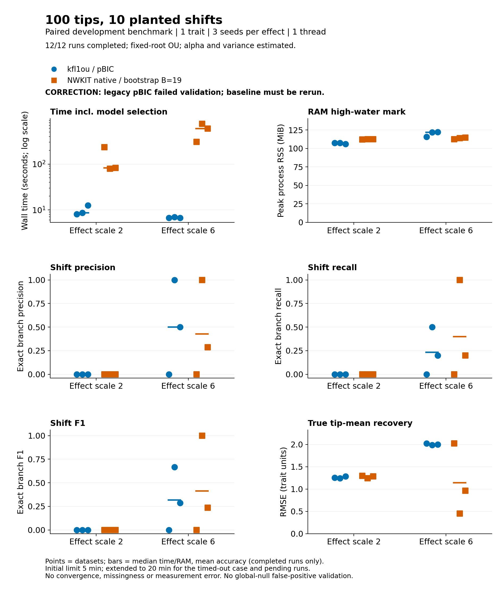

# Measured results

A [new seven-method comparison](../native-ou-100tips-10shifts-ic/RESULTS.md)
uses the corrected pBIC backend and supersedes this historical baseline.

**CORRECTION: the kfl1ou baseline failed the pBIC capability probe.** These are historical measurements of the uncorrected backend, not a valid comparison against corrected pBIC. Baseline rerunning is required. [Post-run audit](pbic-postrun-audit.json).

Six paired datasets: three seeds per effect scale, one trait, 100 tips and ten planted shifts. kfl1ou uses pBIC; NWKIT native includes full-search bootstrap selection (B=19).

Configured kfl1ou was faster: native median total time was 9.6 times higher at effect scale 2 and 88.8 times higher at scale 6. Peak RSS was comparable (roughly 106–122 MiB). At scale 6, exact recovery of all ten branches occurred in 0/3 kfl1ou runs and 1/3 native runs. Native recovery improved in one strong-effect dataset, but another had more false branch selections; neither method consistently recovered the planted configuration.

Native initial search took 3.91–4.27 seconds. Including calibration, each dataset required 20–191 complete searches. Thus these total-time ratios compare the configured selection procedures; they are not a kernel or language speed comparison. B=19 is a coarse development calibration setting, below the workflow default of 199.

| Effect | Method | Complete | Median time (s) | Median RSS (MiB) | Precision | Recall | F1 | Mean RMSE |
| --- | --- | --- | --- | --- | --- | --- | --- | --- |
| 2 | kfl1ou | 3/3 | 8.6 | 107.3 | 0.000 | 0.000 | 0.000 | 1.261 |
| 2 | nwkit | 3/3 | 82.9 | 112.3 | 0.000 | 0.000 | 0.000 | 1.275 |
| 6 | kfl1ou | 3/3 | 6.7 | 121.9 | 0.500 | 0.233 | 0.317 | 2.003 |
| 6 | nwkit | 3/3 | 595.5 | 113.8 | 0.429 | 0.400 | 0.412 | 1.145 |

Accuracy columns are means over completed runs; precision is defined as zero for empty predictions. Resource columns summarize the final observed attempt, with any censoring identified in metrics.csv. No population confidence interval is estimated from three replicates.

The first 300-second native timeout was rerun without changing inference settings under a 1,200-second ceiling; pending runs also used the longer ceiling. Initial and follow-up records are retained separately. The documented kfl1ou tree-order preflight error is excluded after correction and rerun.

[Protocol and reproduction](README.md) · [Point-level metrics](metrics.csv) · [Raw final runs](results.json) · [Vector figure](comparison.svg)

This experiment does not establish false-positive control, convergence-group accuracy, missing/error robustness, multivariate performance or production adoption. The methods have different selection rules and search/optimizer defaults.
