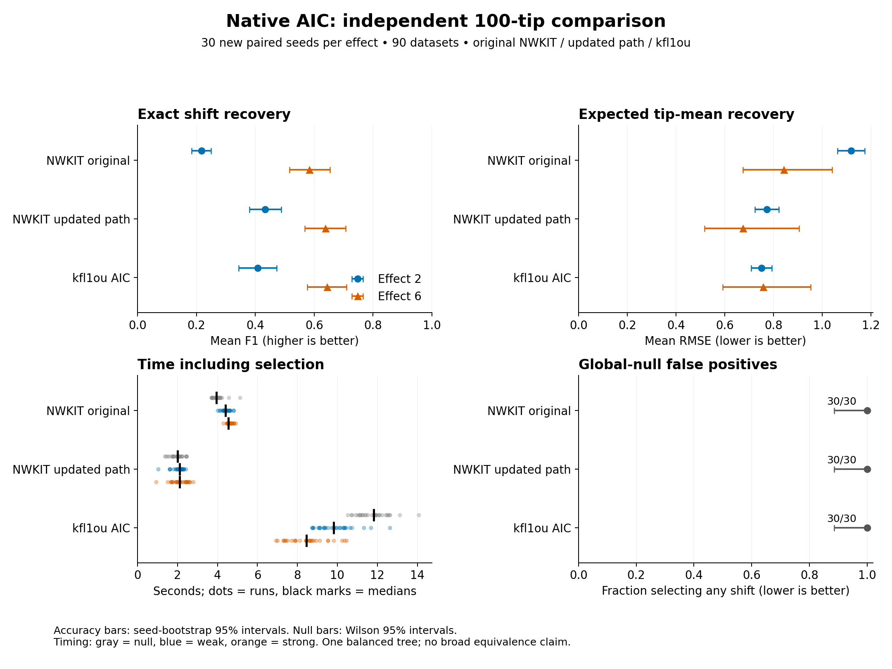

# Independent native AIC comparison

[Adoption decision and limitations](DECISION.md): the path is available explicitly; the original auto default is retained.

Frozen development candidate evaluated on 30 new seeds at each of three effect strengths (90 datasets; 270 configured runs). All methods use a 10-shift cap. No tuning used these results.

| Effect | Method | Complete | F1 | Mean RMSE | Any shift | Mean shift count | Median seconds | Median RSS MiB |
| --- | --- | --- | --- | --- | --- | --- | --- | --- |
| 0 | NWKIT original | 30/30 | — | 0.707 | 1.000 | 9.93 | 3.95 | 112.4 |
| 0 | NWKIT updated path | 30/30 | — | 0.717 | 1.000 | 10.00 | 2.00 | 112.0 |
| 0 | kfl1ou AIC | 30/30 | — | 0.678 | 1.000 | 7.57 | 11.83 | 121.6 |
| 2 | NWKIT original | 30/30 | 0.217 | 1.119 | 1.000 | 9.97 | 4.41 | 112.4 |
| 2 | NWKIT updated path | 30/30 | 0.434 | 0.774 | 1.000 | 9.97 | 2.11 | 112.1 |
| 2 | kfl1ou AIC | 30/30 | 0.409 | 0.752 | 1.000 | 8.07 | 9.81 | 118.0 |
| 6 | NWKIT original | 30/30 | 0.583 | 0.842 | 1.000 | 10.00 | 4.55 | 112.5 |
| 6 | NWKIT updated path | 30/30 | 0.638 | 0.675 | 1.000 | 9.80 | 2.11 | 112.1 |
| 6 | kfl1ou AIC | 30/30 | 0.644 | 0.758 | 1.000 | 8.60 | 8.46 | 124.0 |

F1 measures exact descendant-clade recovery. RMSE compares fitted tip means with noise-free simulated means. Any shift is the global-null false-positive frequency only at effect 0. Null F1/recall are undefined and omitted.

## Paired differences

Positive F1 differences favor the candidate; negative RMSE differences favor it. Intervals resample paired seeds (10,000 replicates, pointwise 95% percentile intervals). These are not simultaneous intervals or proof of equivalence.

| Effect | Compared with | Metric | Candidate minus comparator | 95% interval | RMSE ratio |
| --- | --- | --- | --- | --- | --- |
| 0 | NWKIT original | mean_rmse | 0.010 | [-0.001, 0.021] | 1.014 |
| 0 | NWKIT original | any_shift | 0.000 | [0.000, 0.000] | — |
| 0 | kfl1ou AIC | mean_rmse | 0.039 | [0.031, 0.049] | 1.058 |
| 0 | kfl1ou AIC | any_shift | 0.000 | [0.000, 0.000] | — |
| 2 | NWKIT original | f1 | 0.217 | [0.172, 0.263] | — |
| 2 | NWKIT original | mean_rmse | -0.346 | [-0.408, -0.285] | 0.691 |
| 2 | kfl1ou AIC | f1 | 0.026 | [-0.011, 0.064] | — |
| 2 | kfl1ou AIC | mean_rmse | 0.022 | [-0.005, 0.049] | 1.029 |
| 6 | NWKIT original | f1 | 0.054 | [0.014, 0.095] | — |
| 6 | NWKIT original | mean_rmse | -0.167 | [-0.442, 0.138] | 0.801 |
| 6 | kfl1ou AIC | f1 | -0.006 | [-0.028, 0.017] | — |
| 6 | kfl1ou AIC | mean_rmse | -0.083 | [-0.333, 0.194] | 0.890 |

One balanced tree, one trait, no observation errors or convergence. Nonnull shift count equals the search cap; null count is below it. Do not generalize these estimates to arbitrary trees or traits. Time includes startup and serialization; comparisons are between configured procedures with different candidate sets, not equivalent-output kernel benchmarks. All failed and timed-out runs remain in the denominators and raw records.

[Protocol](PROTOCOL.md) · [Individual metrics](metrics.csv) · [Raw results](results.json) · [Paired intervals](paired-comparisons.json) · [SVG figure](comparison.svg)
