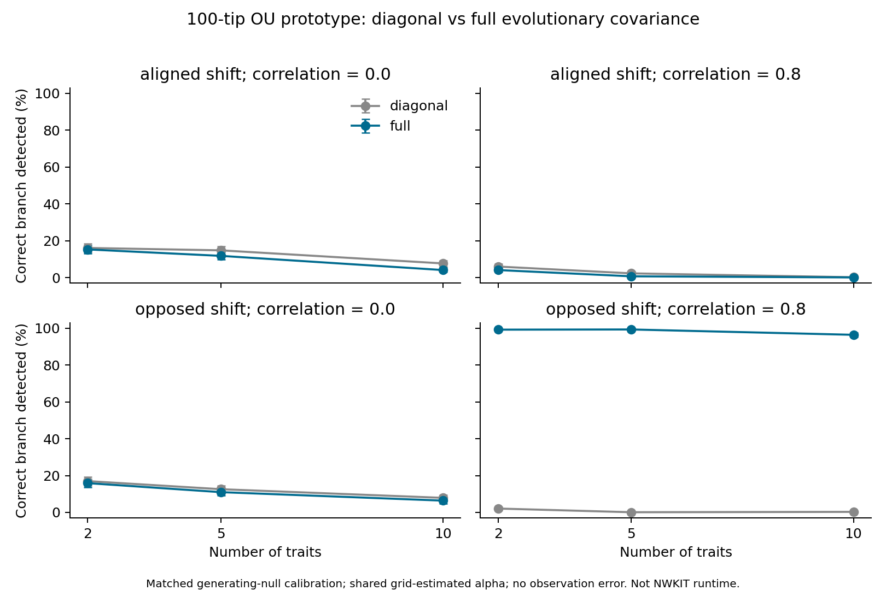

# 100-tip evolutionary trait-covariance experiment

This is a controlled matrix-normal OU prototype, **not a benchmark of the NWKIT implementation**. At the time of this experiment NWKIT native shift fitting supported diagonal trait covariance only. Full covariance and simulation were subsequently implemented locally; see the [implementation status](implementation-proposal.md) and [GeneGalleon integration guide](../../native-ou-shifts.md). These historical results remain a separate oracle experiment. Workflow defaults remain unchanged.

## Protocol

- Fixed nearly balanced 100-tip ultrametric tree, root height 1, OU fixed root. All 198 branches are searched, with zero or one shift. Exact branches, not nearby branches, count as correct.
- Shared alpha is profiled over 0.1, 0.3, 1, 3, 10; generating alpha is 1. Both methods use the identical grid and candidate set. Each layout refits its diagonal or full trait covariance by ML.
- 2, 5, or 10 traits; equal pairwise evolutionary correlation 0 or 0.8; marginal process variance 1. Complete observations without sampling or additional measurement errors.
- Shift clades contain 10–30 tips. Tip mean displacement has total Euclidean length 2, either equally spread in the same direction across all traits, or opposite directions in the first two traits with other traits unchanged.
- 2000 separate null simulations per trait-count/correlation cell calibrate each method’s maximum likelihood-ratio statistic to nominal 5%; 1000 new paired simulations per cell/scenario evaluate it. **Calibration uses the true generating covariance, including correlation for the diagonal method: this is an oracle comparison, not a deployable bootstrap procedure.**
- Timing is one exhaustive search including covariance refits, after warmup; it excludes imports, simulation, reusable tree/design preparation, and null calibration. Method order alternates within each paired replicate. Both methods use the same batched algebra; neither calls NWKIT.
- One container process on an Apple M2 Max; BLAS/OpenMP threads fixed to 1. Image local/genegalleon:nwkit-ou-auto-dev, arm64, image ID sha256:40c8c0c545ca39445a57faac6ba8879e6e1075553426c9ee6d7a8205381b56f8.

## Detection

Correct-branch detection percentages (diagonal → full); intervals are approximate paired 95% Monte Carlo intervals for the change in percentage points, conditional on the calibrated thresholds. They exclude uncertainty in the calibration thresholds.

| Traits | Correlation | Shift | Correct branch, % | Difference, percentage points (95% MC interval) |
|---:|---:|---|---:|---:|
| 2 | 0.0 | aligned | 16.1 → 15.3 | -0.8 (-1.9, +0.3) |
| 2 | 0.0 | opposed | 17.0 → 15.9 | -1.1 (-2.3, +0.1) |
| 2 | 0.8 | aligned | 6.0 → 4.1 | -1.9 (-3.1, -0.7) |
| 2 | 0.8 | opposed | 2.1 → 99.2 | +97.1 (+96.1, +98.1) |
| 5 | 0.0 | aligned | 14.8 → 11.8 | -3.0 (-4.5, -1.5) |
| 5 | 0.0 | opposed | 12.6 → 11.0 | -1.6 (-2.8, -0.4) |
| 5 | 0.8 | aligned | 2.3 → 0.7 | -1.6 (-2.5, -0.7) |
| 5 | 0.8 | opposed | 0.1 → 99.3 | +99.2 (+98.6, +99.8) |
| 10 | 0.0 | aligned | 7.7 → 4.1 | -3.6 (-5.0, -2.2) |
| 10 | 0.0 | opposed | 7.9 → 6.4 | -1.5 (-2.8, -0.2) |
| 10 | 0.8 | aligned | 0.2 → 0.1 | -0.1 (-0.4, +0.2) |
| 10 | 0.8 | opposed | 0.3 → 96.4 | +96.1 (+94.9, +97.3) |



## False positives and search time

| Traits | Correlation | Null false positive %, diagonal → full | Median search ms, diagonal → full | Ratio |
|---:|---:|---:|---:|---:|
| 2 | 0.0 | 5.5 → 5.3 | 0.185 → 0.229 | 1.24× |
| 2 | 0.8 | 3.8 → 5.5 | 0.180 → 0.223 | 1.24× |
| 5 | 0.0 | 4.4 → 4.2 | 0.261 → 0.466 | 1.78× |
| 5 | 0.8 | 4.8 → 5.1 | 0.293 → 0.525 | 1.79× |
| 10 | 0.0 | 5.4 → 5.2 | 0.452 → 1.475 | 3.27× |
| 10 | 0.8 | 4.4 → 4.6 | 0.448 → 1.472 | 3.28× |

## Interpretation and limits

Full covariance greatly helps this experiment’s shifts along low-variance contrasts between strongly correlated traits. It does not generally help changes aligned with their common high-variance direction. With zero correlation, estimating extra covariance entries has no consistent advantage. The effects depend on signal size and direction, tree shape, trait count and noise; these are not general accuracy estimates for GeneGalleon.

The full model estimates p(p+1)/2 covariance entries instead of p (3 vs 2; 15 vs 5; 55 vs 10). Shared alpha and no observation error allow covariance ML in closed form. Trait-specific alpha, missing data, observation variances, multiple shifts and GeneGalleon search budgets could materially change both accuracy and runtime. The measured ratios must not be applied directly to production NWKIT wall time.

Raw results also include an exploratory AICc score with n=100 and mean/covariance/alpha parameter counts. It does not correct for searching 198 branch locations and is not equivalent to NWKIT’s criterion. It is not the basis of the detection comparison. A change in the production covariance model would also require validation of model selection and calibration.

Independent dense Kronecker Gaussian likelihood check: absolute log-likelihood discrepancy 8.53e-14. Peak RSS for the whole experiment including accumulated results: 78.5 MiB; this does not isolate memory by method. Docker validation only; no SIF validation.

## Reproduce

```sh
docker run --rm --entrypoint python -e REPS=1000 -e CAL=2000 \
  -e OPENBLAS_NUM_THREADS=1 -e OMP_NUM_THREADS=1 -e MKL_NUM_THREADS=1 \
  -v "$PWD/docs/benchmarks/ou-trait-covariance-100tips:/bench" \
  local/genegalleon:nwkit-ou-auto-dev /bench/benchmark.py
docker run --rm --entrypoint python \
  -v "$PWD/docs/benchmarks/ou-trait-covariance-100tips:/bench" \
  local/genegalleon:nwkit-ou-auto-dev /bench/summarize.py
```

Files: `benchmark.py`, `summarize.py`, `results.json`, compressed paired `raw.json.gz`, `environment.json`, and plots. Seed and library versions are in environment.json.
