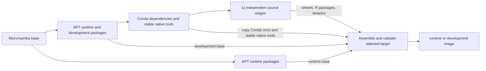

# Container Development

GeneGalleon keeps one scientific environment and builds the eleven moving
upstream sources independently. A source update therefore recompiles that
source before assembling and validating the complete runtime. Normal workflow
edits are read from the mounted checkout and need no container rebuild.



The source stages start from the same dependency environment. Each stage
declares only its own revision arguments; none inherits another moving source
stage. Seven Python wheels, two installed R packages, the PAML `mcmctree`
binary, and the RADTE script are mounted read-only during assembly. Their
archives and source checkouts never become distribution-image layers.
The final image copies `/opt/conda` once, not once per upstream tool.

## Choosing an image

| Command or setting | Result |
| --- | --- |
| `bash ./dev build` | Build `local/genegalleon:dev` with the `development` target; no SIF conversion |
| `BUILD_TARGET=runtime bash ./dev build` | Build the distribution target under the same local tag |
| `BUILD_TARGET=runtime TAG=runtime BUILD_SIF=0 IMAGE_SOURCE=local bash ./gg_container_build_entrypoint.sh` | Keep a separate local distribution image |
| `IMAGE_SOURCE=local bash ./gg_container_build_entrypoint.sh` | Build `runtime`; convert to SIF by default on Linux |
| CI publication and release builds | Publish `runtime` for both supported architectures |

The development target adds the packages in
[`container/apt/development.txt`](../container/apt/development.txt).
Runtime APT dependencies are listed separately in
[`container/apt/runtime.txt`](../container/apt/runtime.txt).
Both targets contain the same scientific packages and undergo the same
required-command validation. Conda compiler packages required by R and other
dependencies remain installed in both targets; the runtime is not claimed to
contain no compilers at all.

The OS package profile is selected before scientific assembly, so a source
update does not reinstall APT development tools. Build wrappers pass matching
Docker `--target` and `--build-arg BUILD_TARGET` values automatically. Direct
Docker invocations must provide both for `development`; the final stages
reject a mismatched profile rather than publishing a mislabeled image.

`io.genegalleon.build-target` records the selected target. Both the full build
fingerprint and the runtime fingerprint include it. An unchanged-load check
cannot reuse the other target, and freshness checks obtain the target from the
actual image or SIF metadata. `BUILD_TARGET` applies to local builds; it cannot
change the contents of a public image that is only being pulled.

## What gets rebuilt

| Changed input | Work repeated with an existing BuildKit cache |
| --- | --- |
| Mounted workflow scripts or tests | No image build unless they are also copied into the image |
| One upstream source revision | Its artifact, runtime assembly, bundled `treevis`, and validation |
| Bundled `workflow/support/treevis` | `treevis` installation and subsequent validation |
| Runtime validation scripts or command manifests | Final validation |
| Security-refresh date | Late APT security refresh and subsequent validation |
| Conda requirements or common build dependencies | Dependency environment and every source artifact |
| Runtime/development selection | Reuse dependencies and source artifacts; assemble on the selected cached OS base |

The wrappers resolve moving branches concurrently with
`resolve_source_revisions.sh`, wait for every lookup to succeed, and pass one
complete snapshot to every platform. An unavailable source stops the build;
there is no partial or older-snapshot fallback. Full `*_REPO_SHA` overrides
remain available for one-off comparisons and debugging, and must not be saved
as repository defaults. Installed revisions are recorded in
`/opt/pg/logs/source_revisions.tsv`.

Native Apptainer/Singularity builds use the same artifact producers and
installer sequentially. For the runtime target they remove APT development
packages before the final runtime checks. They do not provide BuildKit's
independent stage cache. Docker-to-SIF conversion uses the already assembled
image and never includes its intermediate build stages.

## Disk space and parallelism

A smaller distribution image does not imply a smaller build cache. BuildKit
retains the dependency environment and intermediate stages for reuse, and
`MODE=load` temporarily needs space for image export and import. Inspect the
selected builder and Docker storage separately:

```bash
docker buildx du
docker system df
docker image inspect local/genegalleon:runtime --format '{{.Size}}'
```

Image `Size` is the uncompressed sum of image layers. It is not a compressed
registry download size or a SIF size, and adding runtime/development image
sizes double-counts their shared layers. Cache export remains opt-in with
`USE_LOCAL_CACHE=1`; the builder's internal cache is used by default. Do not
remove a shared builder's cache merely to benchmark a cold build.

`GG_BUILD_JOBS` defaults to `2` and controls native Make/R compilation jobs
within each source build. BuildKit separately schedules independent stages,
so this setting is not a cap on the entire build. For a memory-constrained
machine, a dedicated docker-container builder can use a BuildKit configuration
containing:

```toml
[worker.oci]
  max-parallelism = 2
```

Use Docker's [BuildKit configuration documentation](https://docs.docker.com/build/buildkit/configure/#max-parallelism)
to attach that configuration to the intended builder. The repository does not
change a user's existing builder configuration.

## Comparing builds

Resolve the source snapshot once, outside the repository, and reuse those
environment values for both builds. Keep the security epoch, architecture,
builder, output mode, and package inputs equal. Use distinct image tags and
separate source directories; do not overwrite an existing development image
or clear unrelated cache entries.

Compare `/opt/pg/logs/source_revisions.tsv`, Python/R package versions,
required-command reports, and the shared runtime integration tests before
interpreting build timings. Report cold or warm cache conditions explicitly:
an initial build after a Dockerfile restructuring is not directly comparable
to an unchanged cached build. For an upstream-update measurement, change only
one temporary source override, then check the BuildKit log to confirm that
the other ten source stages were cached.

## Measurements on 2026-08-31

Measured on macOS with Docker Desktop, native `linux/arm64`, a 12-CPU,
7.65-GiB Docker VM, and the existing `gg-cache` docker-container builder.
The image comparison used the same eleven upstream revisions, package
requirements, and security epoch. Temporary revision overrides were kept
outside the repository; moving-branch defaults were not changed.

| Measurement | Before | After |
| --- | ---: | ---: |
| Eleven real remote revision lookups, median of three runs | 5.64 s | 0.83 s |
| Distribution image, uncompressed Docker `Size` | 9,135,375,600 bytes | 8,495,142,305 bytes |
| Initial local build including `MODE=load` export/import | 11 min 45 s | 9 min 11 s |
| Sampled BuildKit cgroup peak during those builds | 6.28 GiB | 6.72 GiB |

Revision resolution returned identical snapshots in all comparisons and was
about 85% faster. The distribution image was 640 MB (7.0%) smaller. Python
package versions and required-command reports matched; the only R package
removed was the build-only `remotes` installer. The same csubst scan fixture
produced byte-identical result TSVs in the old and new containers.

The final development image was 9,092,081,288 bytes, with APT GCC, CMake,
Fortran, and Boost headers available. It was built later from the current
moving-branch snapshot, including an intervening amalgkit update, so this is
a separate observed size rather than a strict profile-only comparison.

Initial build times are observations, not a controlled speedup measurement:
package-download caches were not cleared or equalized. The cgroup samples
include filesystem cache and are not process RSS. A subsequent attempt to
measure a single-source update lost unchanged APT/dependency cache entries
on the shared builder, so that run is excluded from warm-build comparisons.
Independent stages avoid rebuilding unrelated sources only while their
BuildKit cache is retained. No manual purge of pre-existing user cache or
builder configuration change was performed for this comparison.

Cache isolation was checked separately on the `desktop-linux` Docker builder,
using the built development image as a fixed dependency environment and the
unchanged eleven source-stage definitions and artifact installer. Changing
only the temporary csubst revision rebuilt csubst; the other ten source stages
reported `CACHED`, and only csubst changed in the installed source manifest.
This checks source-stage reuse, not the duration of a complete image rebuild.

The final distribution image passed all 1,819 Python tests with strict runtime
checks and all seven declared R validation commands. The development image
also passed the runtime lane (19 tests), both extra runtime tests, and the
same seven R commands. Its installed revisions and runtime fingerprint matched
the current checkout and all eleven moving branches.

Native SIF execution and amd64 builds were not measured on this host; the image
sizes above do not establish SIF or registry-download sizes.
