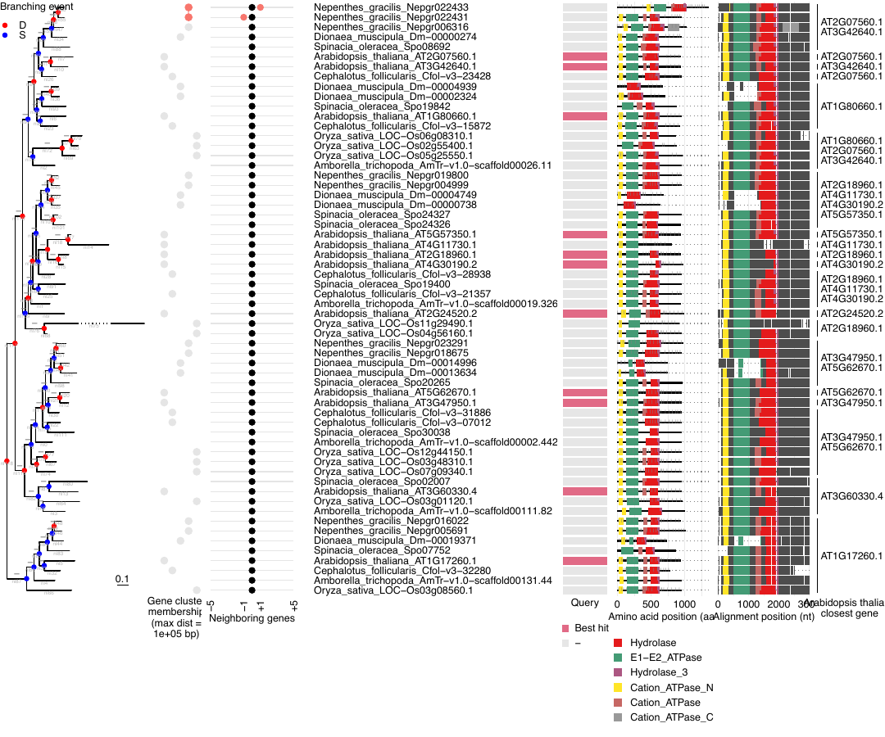
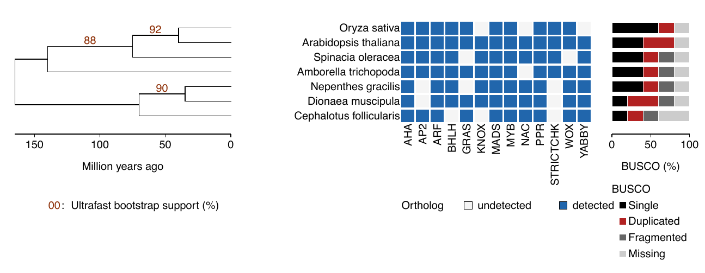
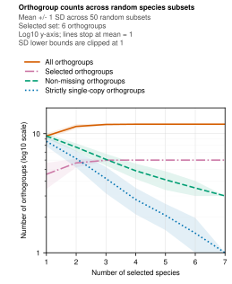
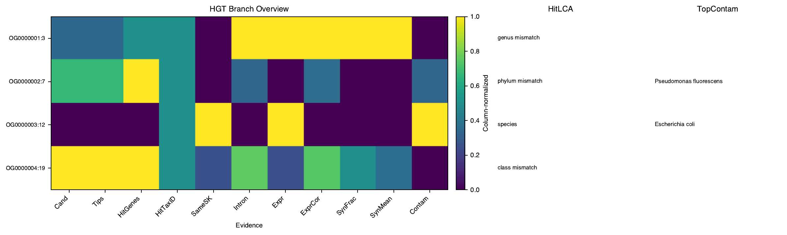
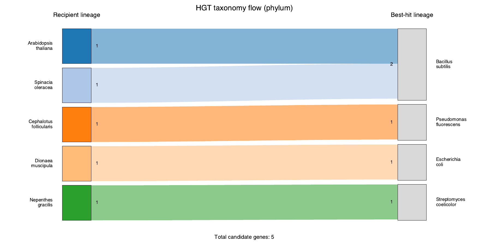

# Example Plots

This page shows small, documentation-sized GeneGalleon plots generated from
bundled test inputs. The examples are intentionally compact: they are useful
for recognizing output shapes, not for biological interpretation.

Regenerate the images from the repository root with:

```bash
python docs/assets/example-plots/generate_example_plots.py
```

The generator writes its tiny input tables under
`docs/assets/example-plots/test-data/` and then calls the same support scripts
used by the workflow where possible. The quick-start tree-plot PNG is refreshed
when `workspace/output/query2family/tree_plot/AHA_tree_plot.pdf` is present.

## Query2family tree plot

The per-family `tree_plot` combines the gene tree with panels such as tip
labels, domains, expression, synteny, and query markers. This example was
rendered from the bundled quick-start `AHA` query2family test output.



## Gene-family presence/absence summary

`gg_gene_summary_entrypoint.sh` can summarize query2family or orthogroup output
as a species-tree-aligned detected/undetected matrix. When BUSCO summaries are
available, the right side adds per-species quality bars.



## Orthogroup rarefaction

`gg_genome_evolution_entrypoint.sh` plots rarefaction curves for all,
filter-selected, non-missing, and strictly single-copy orthogroups as more
species are included in random subsamples. The y-axis is log10-scaled, each
shaded band shows one standard deviation across replicates, and a curve stops
when its mean reaches one orthogroup.



## HGT summary plots

HGT summary mode produces overview and taxonomy-flow plots from candidate
branch and gene tables. The overview heatmap compares evidence columns across
candidate branches.



The taxonomy-flow plot links focal candidate lineages to best-hit lineages at
the requested rank.


