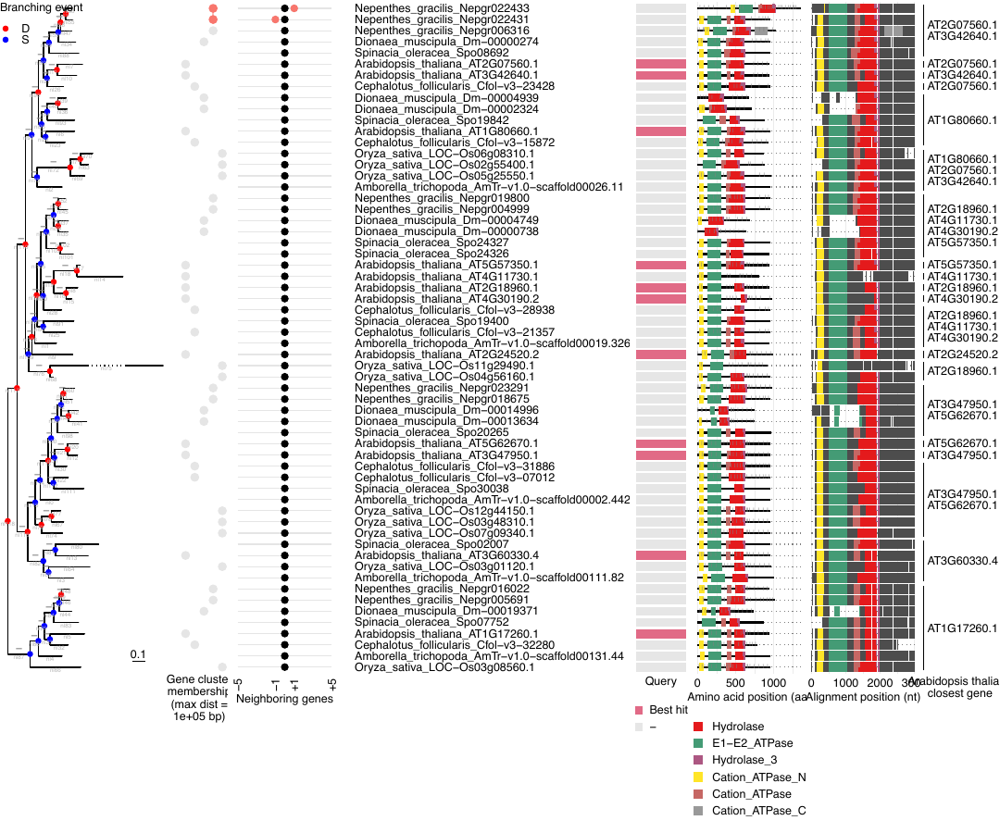
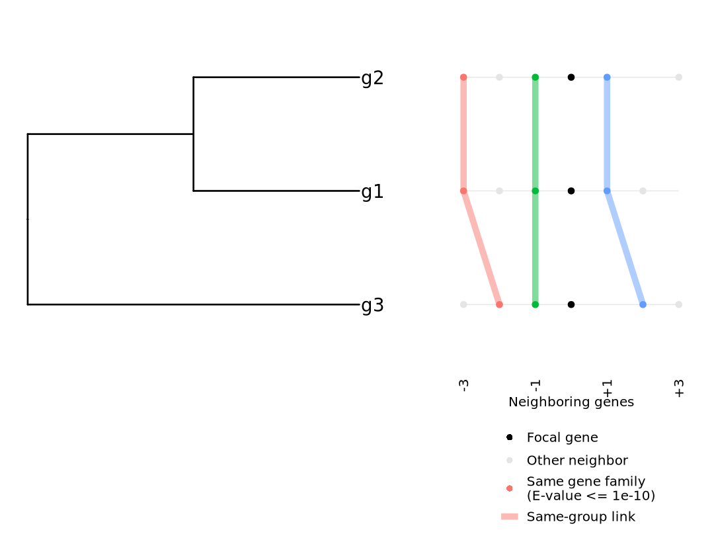
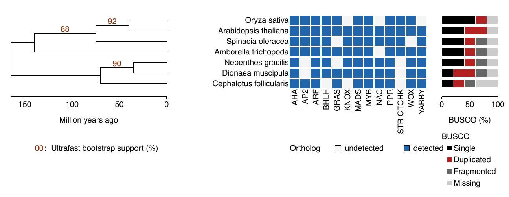
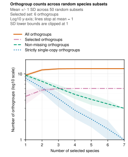
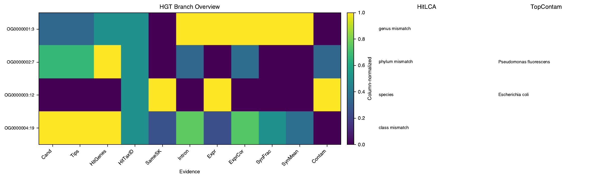
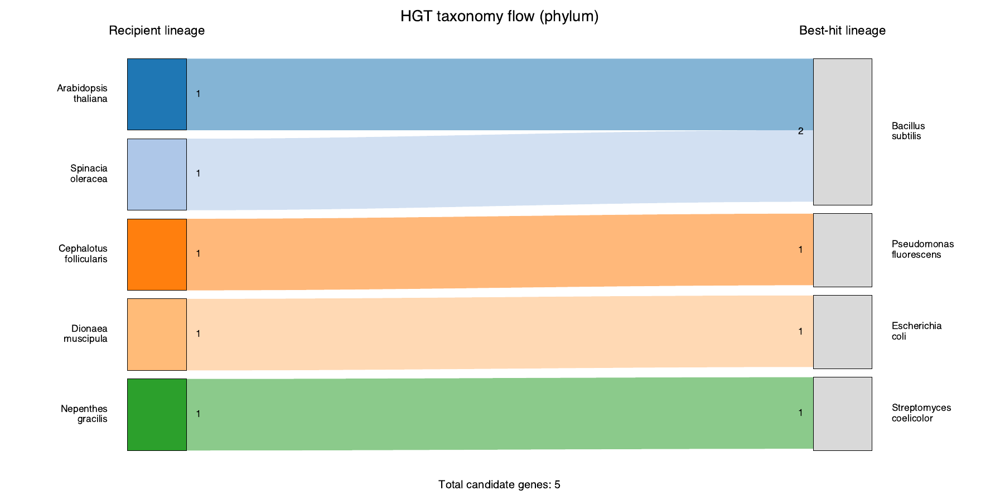

# Example Plots

This page shows small, documentation-sized GeneGalleon plots generated from
bundled test inputs. The examples are intentionally compact: they are useful
for recognizing output shapes, not for biological interpretation.

Regenerate the images from the repository root with:

```bash
python docs/assets/example-plots/generate_example_plots.py
```

The generator writes its tiny input tables under
`docs/assets/example-plots/test-data/` and then calls the same support scripts
used by the workflow where possible. The quick-start tree-plot PNG is refreshed
when `workspace/output/query2family/tree_plot/AHA_tree_plot.pdf` is present.

The README figures use the completed bundled `AHA`, `STRICTCHK`, and `YABBY`
query2family outputs. The generator recalculates AHA synteny from the bundled
species CDS and GFF inputs before drawing the tree plot and the reference-gene
ortholog summary. The tree plot omits the expression pointplot while retaining
the expression heatmap. The ortholog summary includes local-synteny and gene-tree
UFBoot evidence bands. To refresh the figures
with a current GeneGalleon runtime and host `pdftoppm`, run:

```bash
bash docs/assets/example-plots/generate_readme_plots.sh
```

The ortholog summary bars count original species-overlap D nodes with displayed
genes in both child subtrees. See [duplication bar interpretation](presence-absence.md#interpret-duplication-bars)
and [additional ortholog candidates](presence-absence.md#flag-candidates-across-low-confidence-duplication-nodes)
for the scope and optional score threshold.

In the README AHA plot, thin gray lines connect genes from the same species
across clusters; colored lines join members of a distance-defined cluster.
Cluster colors follow the species label hue, with shade variations when a
species has multiple clusters.

## Query2family tree plot

The per-family `tree_plot` combines the gene tree with panels such as tip
labels, domains, expression, synteny, and query markers. This example was
rendered from the bundled quick-start `AHA` query2family test output.



## Neighboring genes legend

This synthetic three-tip example shows focal genes (black), other recorded
neighbors (gray), shared similarity groups (colors), and same-group links.
The bottom legend has no title; its `Same gene family` entry includes the
search cutoff, here `E-value <= 1e-10`.



Regenerate it in a GeneGalleon runtime containing the current treevis package:

```bash
Rscript workflow/tests/test_treevis_synteny.R output/examples/synteny-legend
```

This also exercises the workflow's `stat_branch2tree_plot.r` driver and writes
its PDF alongside the compact PNG/PDF example and input TSVs.

## Gene-family presence/absence summary

`gg_gene_summary_entrypoint.sh` can summarize query2family or orthogroup output
as a species-tree-aligned detected/undetected matrix. When BUSCO summaries are
available, the right side adds per-species quality bars.



## Orthogroup rarefaction

`gg_genome_evolution_entrypoint.sh` plots rarefaction curves for all,
filter-selected, non-missing, and strictly single-copy orthogroups as more
species are included in random subsamples. The y-axis is log10-scaled, each
shaded band shows one standard deviation across replicates, and a curve stops
when its mean reaches one orthogroup.



## HGT summary plots

HGT summary mode produces overview and taxonomy-flow plots from candidate
branch and gene tables. The overview heatmap compares evidence columns across
candidate branches.



The taxonomy-flow plot links focal candidate lineages to best-hit lineages at
the requested rank.


