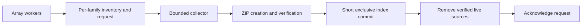

# ZIP storage for large gene-family arrays

Array workers record their own output destinations and publish a durable archive
request. They do not scan the output tree, compress ZIPs, update the shared archive
index, or compact old shards when they finish. Analytical completion and archive
completion are separate: live files remain readable until the collector commits
and verifies their ZIP replacement.

Run `gg_progress_summary` regularly during a large array to recover storage space.
Each invocation drains up to 100 batches per gene-family root after generating its
summary. Without a collector, requests and live output files intentionally remain
on disk. The queue is durable; it is not a background service.



## Collection and limits

Run these commands inside the GeneGalleon runtime, from the repository root:

```bash
# Inspect analytical states and pending archive requests.
bash workflow/gg_gene_family_archive.sh queue-status \
  --root workspace/output/orthogroup

# Collect at most 100 batches, even while unrelated families are running.
bash workflow/gg_gene_family_archive.sh drain-queue \
  --root workspace/output/orthogroup --mode orthogroup \
  --genecount workspace/output/orthofinder/Orthogroups_filtered/Orthogroups.GeneCount.selected.tsv \
  --batch-families 100 --batch-bytes 1073741824 --max-batches 100 \
  --nonblocking
```

For query2family, use `--mode query2family --query-dir workspace/input/query_gene`.
Only one collector runs per output root. Other collectors report `collector-busy`;
workers continue to publish requests. Busy families are skipped independently.
Each batch defaults to 100 families and 1 GiB of source data. A single family or
file larger than the target is allowed so collection can make progress; limits
are batching targets, not hard memory or disk quotas. ZIP streams use bounded
buffers and ZIP64. Shards also default to a 1 GiB source-byte target and 5,000
files. A single oversized file stays in one member.

Requests capture the worker's compression, compression level, ZIP worker count
and part-size setting. A batch groups compatible requests. The collector's CLI
settings supply defaults for requests submitted through the Python API without
write options. `--workers` remains capped at four. A worker's
`gene_family_final_zip_max_bytes=0` uses the 1 GiB target during queue collection;
it still means unlimited size for an explicitly requested final ZIP.

The collector emits JSON with selected/deferred/stale family counts, source and
ZIP bytes, archived file count, preparation time, commit time and total time.
`queue-status` reports total pending families, running families, ready families,
stale requests and the age of the oldest request. These are snapshots while jobs
are active. `drain-queue` refreshes `ARCHIVE_STATUS.tsv` once after its batches.

Collection only adds immutable shards. It never recompresses the historical ZIP
set. Run `compact` or `finalize` explicitly after the array has finished. A
positive `--max-final-zip-bytes` retains parts for large output sets. Existing
manual `archive-family` and `archive-completed` commands remain available for
untracked/manual live outputs; they use a directory scan. `archive-completed`
also retains its explicit maintenance/finalization behavior. Progress summaries
use the queue instead of invoking this full scan and finalization on every run.

## Concurrency and durability

Each family has its own lock, distributed across 256 directories. A shared
family gate allows offline conversion/purge to exclude all families, including
families whose locks do not exist yet. A separate producer run lock is keyed by
family rather than array-task number, so the same family cannot run twice merely
because it was assigned two task IDs. State-update locks remain striped because
they protect only short state-file updates. Their stripe is derived from the
state-file bucket, so all writers of one JSON file share the same lock.

Output inventories are recorded before publication by the file-movement helpers.
The workflow also records declared `file_og_*` destinations, covering tools that
publish directly, and records existing outputs encountered during materialization.
Per-process journals avoid concurrent appends to the same NFS file. The collector merges
those journals under the exclusive family lock; enqueue never replaces or deletes
a publisher’s open journal. Inventories survive reruns. New entries use paths
relative to the output root so pending work survives workspace relocation. Missing
inventories, symlinked inventory directories, and absolute entries outside the
current root fail collection without acknowledging the request. Collect older
absolute-path inventories at their original location before moving the workspace.
Failed and skipped publication candidates are harmless: collection checks current
file existence, family ownership, and regular-file/symlink constraints.

A request is published at task startup and refreshed at exit. The collector locks
the selected families, rejects running/stale run tokens, and reserves generations
under the shared-store locks. It then releases the store-wide locks during ZIP
creation, CRC validation and source hashing. The selected family locks remain
held. A brief exclusive section reloads the current index, publishes immutable
ZIPs, commits the indexes, rechecks source signatures and deletes verified source
files. Only then are requests acknowledged. Other readers can continue during
compression; index changes and live-source removal exclude them.

Inventory and lock metadata scale with the number of families, instead of the
number of analytical artifacts. For 10k families, expect roughly 10k persistent
inventories plus per-family lock namespaces. Temporary journals and pending
requests are additional files. This trades a bounded amount of per-family
metadata for independent progress and removes repeated whole-tree work from
array-task exits.

## Upgrade and recovery

**Stop every job using an output root before switching to this locking layout.**
Do not mix a runtime using the old striped family locks with the per-family-v2
runtime. The ZIP member format is unchanged. New runs register existing live
outputs during materialization; for manual/untracked outputs, use the explicit
`archive-completed` maintenance command after the jobs stop.

Ordinary collector exceptions release locks and retain requests and live sources.
After an interrupted index commit, run `repair` before retrying collection.
After SIGKILL or node loss, namespace locks deliberately remain closed. Their
owner records include host, PID, job ID, array-task ID, creation time and token.
Inspect the affected lock named in the error:

```bash
python workflow/support/shared_namespace_lock.py inspect /absolute/path/to/lock
```

Confirm through the scheduler and execution hosts that all users of that workspace
have stopped before releasing leftover ownership records. A PID on a different
host or the age of a record is not sufficient evidence. For a confirmed dead
owner, release its exact inspected token using `release-shared` or
`release-exclusive` as appropriate:

```bash
python workflow/support/shared_namespace_lock.py release-exclusive \
  /absolute/path/to/lock --token TOKEN_FROM_INSPECTION
```

Do not clear the whole lock tree. A gate without an owner record needs manual
inspection after stopping all users; the release commands intentionally refuse
to guess ownership. If the analytical state remains `running`, reconcile it with
`mark-failed --root ROOT --family-id FAMILY --run-token ORIGINAL_TOKEN` after the
producer is confirmed stopped. Then repair a pending index if necessary and run
`drain-queue` again. The collector removes its abandoned private staging
directories only after acquiring exclusive collector ownership. Published ZIPs
are never deleted as abandoned staging; repair uses their manifests.

## Reproducible measurements

The benchmark fixture is `workflow/benchmarks/benchmark_archive_queue.py`.
It creates 10,000 family outputs, archives a configurable number, and verifies
every logical output with SHA-256. It reports wall time, peak RSS, directory
entries returned by `Path.iterdir`, ZIP bytes written, ZIP-write count and
compaction count. The enumeration counter excludes glob traversal and is not a
filesystem IOPS counter.
Use `--module-root BASELINE/workflow/support` to run the identical workload
against a baseline checkout. Run each mode separately on the same filesystem:

```bash
python workflow/benchmarks/benchmark_archive_queue.py --implementation per-family
python workflow/benchmarks/benchmark_archive_queue.py --implementation queued
python workflow/benchmarks/benchmark_archive_queue.py --implementation queued --completed 10000
```

Docker-local measurements verify the algorithm and bytes, not Lustre/NFS behavior.
Before a large production rollout, repeat on the target shared filesystem with
simultaneous workers, long-running families, job termination and quota exhaustion.

### Recorded Docker run (2026-09-07)

[Raw measurements](../workflow/benchmarks/archive_queue_results_20260907.json)
compare baseline `c3ca724` with queue collection using the same runtime and
10,000 deterministic 1 KiB artifacts. Fixture creation and final verification
are excluded from the timed interval; queue inventory creation is included.

| Metric: archive 200 of 10,000 families | Per-family baseline | Queue collector |
| --- | ---: | ---: |
| Median wall time, 3 runs | 26.28 s | 2.28 s |
| Observed wall-time range | 25.81–27.33 s | 1.66–2.37 s |
| ZIP writes | 224 | 2 |
| Historical ZIP compactions | 24 | 0 |
| ZIP bytes written, approximately | 3.34 MB | 0.25 MB |
| SHA-256 checks after each run | 10,000 passed | 10,000 passed |

A separate run published all 10,000 requests with 32 threads and collected them
in 105.48 seconds, producing 100 ZIP shards with all 10,000 logical SHA-256
checks passing. Peak process RSS was about 60.4 MiB. This is a synthetic
container-local storage measurement; Docker shares host resources, and no
production shared-filesystem throughput or full-workflow speedup is claimed.

Files-mode and debug reruns cancel prior collection requests before publishing
outputs, while holding the producer run lock and shared family lock. Debug runs
do not submit new requests. The `cancel-family-archive --root ROOT --family-id ID`
command performs this cancellation; callers must serialize family producers.
Collectors hold the shared maintenance gate throughout queue enumeration and
staging, and return `maintenance-busy` while offline conversion owns that gate.
