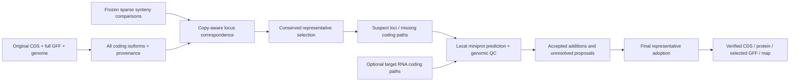

# Synteny-guided gene-model refinement

GeneGalleon can preserve all annotated coding isoforms, select corresponding
isoforms across species, revise incomplete existing models, and add supported
coding paths. This is opt-in. Ordinary input generation and longest-CDS behavior
remain the default.

The scientific design and related methods are described in the
[design plan](synteny-gene-model-refinement-plan.md). The implementation is an
experimental conservative annotation aid. Its score cutoffs are ranking rules,
not calibrated probabilities or estimates of annotation accuracy.

## Workflow



1. **Catalog:** reconstruct every annotated nuclear coding transcript from the
   exact genome and GFF; retain source transcript identity, gene ownership,
   unpadded CDS, phase, protein, quality and source hashes. Missing phase may be
   inferred only for a unique intact genomic ORF bound to an agreeing source CDS;
   unknown and conflicting phases remain separate quality states. UTR-only transcript
   differences retain their identities. Organelle paths follow the existing
   exclusion policy and remain in a separate audit. Original files are immutable.
2. **Selection:** freeze gene-level correspondence from verified existing rescue
   comparisons or an explicit correspondence table. Compare reciprocal protein
   coverage, identity, coding splice positions/phases and independent target
   evidence. Optimize deterministic connected components with a bounded
   multi-seed coordinate heuristic; it does not guarantee a global optimum. Select one record per
   locus, preserving all paralog/WGD copies. Conflicting copy correspondence,
   weak margins, candidate limits and possible genuine internal-exon loss cause
   abstention and retention of the source representative.
3. **Revision/addition:** predict only nominated loci and donor coding paths in
   bounded genomic windows. A locus omitted from the anchor set can acquire
   correspondence between two conserved flanks when bounded gene counts/order
   and independent protein similarity agree. Predictions must have the correct
   locus/strand, canonical splice sites, consistent phases, genomic start/stop,
   sufficient protein coverage/identity and no frameshift, internal stop or
   assembly ambiguity. Overlap with another locus remains a proposal. Split or
   merged genes are not applied automatically.
4. **Effective inputs:** retain original transcripts in `full_annotation`, add
   accepted paths with stable assembly/coordinate/phase/CDS-derived IDs, and
   publish a selected GFF with the exact transcript behind every representative.
   Original selected transcripts retain their source exon/UTR metadata. CDSs of
   unresolved biological negatives remain unchanged; unusable translations are
   excluded from the analysis protein FASTA with an explicit admission audit.
   An unexplained source-CDS/genome disagreement or unreconstructible locus is
   excluded from the effective sequence/GFF view with `effective_exclusions.tsv`;
   exact supplied CDS bytes and original annotation remain in `source_cds` and
   `source_annotation`. GTF relationships are made explicit in selected GFF3.
   Accepted additions may extend the derived gene bounds, recorded in
   `gene_bounds_changes.json`; source annotation remains unchanged.

A primary-only CDS FASTA is sufficient when the supplied GFF retains all coding
transcripts and the exact genome is available. If the GFF itself has already
removed alternative transcripts, the catalog cannot recover their identities or
UTR metadata; supply the full original annotation via the explicit input TSV.

Gene-only FASTA headers are associated with the uniquely possible coding
transcript even when its supplied sequence disagrees with the genome. That
disagreement excludes the reconstructed candidate; it is not hidden by treating
the source record as unbound. When no transcript explains a gene's supplied CDS,
the unresolved candidates are withheld and the exact source record is archived.
Two explained formatter conventions retain genomic DNA without editing the
supplied record. A leading `NNN` envelope and additional 5-prime sequence are
recognised only when the remainder and the exact genomic CDS are suffixes of
the same annotated exon transcript, with consistent CDS phases and no genomic
internal stop or protected exception. This records exon coordinates, sequence
hashes and removed prefix length; it does not invent a start or terminal stop.
Same-length differences consisting only of `N` versus an uncertain IUPAC symbol
are recorded as uncertainty masking. Resolved-base changes and disjoint symbols
remain mismatches. Genomic ambiguity remains in the DNA, and its translation is
withheld. `partial`, `ambiguous` and `valid_orf` remain separate admission flags.
If several transcript identities share one exactly matching genomic coding path,
the source coding path remains the selection baseline without claiming a unique
transcript identity. A longer, unsupplied isoform does not silently replace it.
That unique source coding path can also supply missing phase evidence when the
genomic ORF is complete and all known phases agree. Its transcript identities
remain ambiguous, its original blocks are retained, and the inference basis is
recorded separately. Partial ORFs, distinct genomic paths with equal DNA,
conflicting phases and translation/annotation exceptions remain unresolved.

Two donor isoforms from one species count as one donor. Homology-only additions
at an already intact locus remain nonrepresentative until target RNA supports
the whole coding path. A supported repair of an incomplete original can become
representative after the independent selection gates. An accepted candidate is
therefore not automatically the chosen representative. True species-specific
isoforms, pseudogene annotations, translation exceptions and genomic disruptions
are protected.

Translation follows GeneGalleon's existing context-free codon-table convention:
alternative initiator codons retain their ordinary residue, such as TTG → L
and GTG → V. This does not interpret complete-CDS initiation context. A path
containing an in-frame dual-coding stop codon (including its terminal codon)
is retained as DNA/annotation but withheld from comparative, protein and coding
analysis admission with `translation_uncertain`; whole-path RNA support does
not override this unsupported translation context.

The first predictor backend is miniprot. The existing missing-gene rescue
workflow's optional GeMoMa backend remains available separately; the new
existing-locus refinement does not invoke it. No new predictor/container
installation is required.

## Run from input generation

Set `run_gene_model_refinement=1` in
`workflow/gg_input_generation_entrypoint.sh`, or use a scoped override:

```bash
GG_INPUT_RUN_GENE_MODEL_REFINEMENT=1 \
  bash workflow/gg_input_generation_entrypoint.sh
```

Without explicit raw inputs/correspondence, the stage reuses
`gene_model_refinement_rescue_dir` or the configured `gene_model_rescue_dir`.
If no plan exists there, it prepares the existing sparse donor/synteny plan using
formatted CDS/GFF/genome, comparable first-pass BUSCO summaries and the initial
species tree. Configure `gene_model_rescue_tree` and donor/reference parameters
as for [missing-gene rescue](gene-model-rescue.md). A completed comparison is
reused only when its frozen source/tool/receipt contract verifies.

When the same rescue directory contains a completed, verified `augmented`
publication, refinement uses those CDS/GFF inputs, retaining rescued missing
models in the final representative set. Species genetic codes come from the
frozen rescue plan. Combined array runs prepare the refinement plan after
rescue finalization; a plan frozen before augmentation must use a new refinement
output directory. Explicit `--inputs` and `--rescue-output` are mutually exclusive.

Important settings:

| Variable | Default | Meaning |
| --- | --- | --- |
| `run_gene_model_refinement` | `0` | Enable the new stage. |
| `gene_model_refinement_policy` | `conserved` | `longest` or `conserved`. |
| `gene_model_refinement_mode` | `conservative` | `off` skips prediction; `audit` retains prediction proposals; `conservative` accepts only supported predictions. |
| `gene_model_refinement_dir` | blank | `output/input_generation/gene_model_refinement`. Use a new directory for changed inputs/settings/implementation. |
| `gene_model_refinement_inputs` | blank | Optional original species CDS/GFF/genome TSV, paired with `gene_model_refinement_edges`. |
| `gene_model_refinement_rescue_dir` | blank | Explicit frozen synteny plan to reuse. |
| `gene_model_refinement_rna` | blank | Target whole coding RNA-path evidence TSV. |
| `gene_model_refinement_min_margin` | `0.10` | Experimental score margin for adoption. |
| `gene_model_refinement_min_support` | `2` | Independent donor species for acceptance/adoption. |
| `gene_model_refinement_candidate_limit` | `32` | Exceeding the selection limit abstains; prediction does not silently truncate alternatives. |
| `gene_model_refinement_padding` | `2000` | Local window padding in bp. |

Prediction coverage, identity, maximum interval and intron limits use the
existing `gene_model_rescue_*` settings. Representative adoption separately
requires reciprocal protein coverage ≥0.75 and aligned identity ≥0.35, as well
as its margin and donor gates. These distinct comparisons are not accuracy
estimates. The new output namespace does not replace rescue
outputs or install files into curated `workspace/input`.

Slurm submission uses the existing array helper:

```bash
python workflow/gg_input_generation_array.py \
  --task-plan workspace/output/input_generation/tmp/task_plan.json \
  --refinement --max-running 8 --cpus 4 --memory 32G
```

This prints the submission plan. Add `--submit` to submit it. The order is initial
finalize/plan, sparse comparison and catalog workers, correspondence/selection,
species prediction workers, then final export/QC. `--rescue --refinement` also
runs missing-gene rescue. `--retry` rejects active refinement workers before
submitting and rechecks idempotent stage receipts; it never treats a receipt
filename alone as completion. Predictor CPU/memory/concurrency can use the
existing `--rescue-cpus`, `--rescue-memory`, `--rescue-max-running` settings.

## Standalone and restartable CLI

Run these commands in the GeneGalleon runtime, from the repository root:

```bash
python workflow/support/gene_model_refinement.py plan \
  --rescue-output /path/to/current-frozen-rescue \
  --output /path/to/refinement --policy conserved --mode conservative
python workflow/support/gene_model_refinement.py run \
  --output /path/to/refinement --cpus 4
python workflow/support/gene_model_refinement.py qc --output /path/to/refinement
```

Stages can also run independently: `catalog`, `correspondence`, `select`,
`predict`, `finalize`, `status`, `qc`. Catalog/prediction workers accept
`--task-index` in frozen species order. Only complete stages are published, with
source/tool/dependency/content receipts and locks. A failed attempt retains its
diagnostics. Modified frozen inputs or implementation fail rather than using
stale predictions.
`qc` checks every required publication against the current frozen dependency
graph, including missing stages. A copied effective input TSV must match its
published bytes; changing species membership or genetic codes is not permitted
by retaining the sequence hashes.

For an externally reviewed graph, `plan --inputs sources.tsv --edges edges.tsv`
avoids rebuilding synteny. Paths in `sources.tsv` may be relative to that table;
columns are `species`, `cds`, `gff`, `genome`, `genetic_code` (default 1).
`edges.tsv` requires `species_a`, `gene_a`, `species_b`, `gene_b`; optional fields
are `weight` (0–1], `evidence`, `ambiguous`. Gene IDs are the catalog's formatted
locus IDs, not transcript IDs. Supplied correspondence is an explicit research
input, not automatically an orthology truth set.

RNA evidence columns are `species`, `seqid`, `strand`, `cds_blocks`,
`transcript_id`, `count`. `cds_blocks` is a JSON list of zero-based, half-open
coding intervals in transcript order. The entire coding path must agree with
one target transcript. A collection of individually supported junctions does not
establish co-occurrence and must not be entered as a complete RNA path. This
release consumes reviewed paths, rather than inferring them from BAM files.
Exact matching paths support both existing annotated candidates and new
predictions. Paths are indexed once for matching; partial paths and separately
supported junctions do not strengthen a full transcript choice.

## Review figures

After `qc` succeeds, render a separate review directory in the same runtime:

```bash
python workflow/support/plot_gene_model_refinement.py \
  --output /path/to/refinement --report /path/to/refinement-review \
  --cds-dir /path/to/all-dataset-species-cds \
  --max-loci 200 --preferred-species Species_name
```

The helper verifies the consumed publication hashes, produces `summary.png`
and `summary.svg`, and embeds the summary and locus diagrams in a self-contained
`review.html`. The summary counts every native species. `--cds-dir` also includes
species without a matching genome/GFF in the plan, with grey rows marked
`not analysed` and unavailable counts instead of zero improvements. Their CDS
remains unchanged. The detailed gallery is bounded
by `--max-loci`, prioritizes the requested species and changed/accepted loci, then
fills remaining slots with prediction proposals. Search the gallery by species,
gene identifier or selection decision. `review_data.json` retains the report's
provenance and numerical inputs in the review directory.

Coding paths, affected loci and changed representatives are different counts.
The summary separately counts admitted representatives with resolved source
phases. These counts include the earlier unique-transcript inference and the
unique coding-path inference above; they are not predicted isoform additions.
The diagrams preserve genomic spacing and strand, label source and selected
paths, and expose phase, donor, RNA and rejection evidence. A source coding-path
label may refer to identical coding paths with unresolved transcript identity.
Whole RNA-chain support does not establish translation initiation or protein
function. Review files are never added to the immutable refinement publication.
Source coding-path phase resolutions can fill unused gallery slots. Their
original phase blocks and inference basis are available in the evidence panel.

When `run_species_busco=1`, input generation also evaluates the before/after
representative DNA CDS sets and writes `busco_comparison.png`, `.svg`, `.tsv`
and `.json` under `gene_model_refinement_dir.review/busco`. The review is separate
from the immutable native publication. Both evaluations use transcriptome mode,
e-value `1e-03`, limit 20, the same BUSCO/tool binaries and one local lineage
whose contents are hashed. The before set is the frozen refinement source,
including earlier rescued genes when supplied; the after set is selected
representative DNA, rather than all candidate isoforms or the admitted-only
protein view. Grey CDS-only species remain visible and are evaluated unchanged.
Exact unchanged input bytes reuse the corresponding evaluation. Per-species
receipts permit verified restarts; changed inputs, implementation or settings
require a new report directory. Failed or incomparable evaluations do not
produce a completed comparison. Deltas use integer BUSCO counts, avoiding
rounding errors in the displayed summary percentages.
The comparison also shows per-species missing-gene rescue counts and accepted
repair/additional-isoform coding paths. Rescue counts are unique gene features
with source `genegalleon_rescue` in the frozen annotation and are already included
in the before set. Coding paths are counted separately from gene loci; repair
and isoform paths can belong to the same locus. Unanalysed species show unavailable
counts rather than zeros. `model_change_summary.json` records these counts and
their source hashes. BUSCO stacks use the existing GeneGalleon palette: black
single-copy, firebrick duplicated, dark grey fragmented and light grey missing.
When the original completed rescue publication is available, rescued genes are
stacked in four support categories: S only (self-species homology), R only
(nearest relatives), P only (phylogenetically balanced references), or multiple
(at least two of S/R/P). Classification uses all consolidated
`support` records of each accepted model, deduplicates donor species, and counts
each gene locus once. A donor in both frozen reference lists supports both
types, so the multiple category does not require two distinct donor species.
Two donors in R alone still count as R only. The four categories must sum to
the source GFF gene count, with matching accepted
model IDs and verified plan/model/augmentation receipts. Donor memberships and
per-gene supporting species are saved in `model_change_summary.json`.
Rescue model IDs can name gene or transcript features; explicit GFF `Parent`
links map transcript identities to gene loci without guessing suffixes.
Self-species support must belong to a frozen self-synteny comparison.
A locus with S+R, S+P, R+P or S+R+P support belongs to multiple, so each
gene appears once. Each bar's label shows the total across all four segments.
When donor groups are available, the accepted-coding-path panel shows two bars
per species: the upper bar partitions paths into repairs and additional
isoforms, and the lower bar partitions the same paths by supporting donor group.
The lower bar uses the rescue colours and frozen nearest/balanced lists. It
also includes an `Other interspecies only` segment for paths supported solely
by interspecies donors outside those lists and without S support, which can
occur through reverse correspondence edges. Only means exactly one of S/R/P;
any additional unselected donors remain in the saved per-path evidence.
Self support means homology support from the target
species, not target RNA evidence. Counts use the recorded accepted prediction
`donors`, cross-check candidate support and alignments, and count each candidate
path once. Each lower bar must sum to the upper bar's repair plus isoform total.
`rescue_support_groups` and `accepted_path_support_groups` store the current
S/R/P counts. Legacy `rescue_support_counts`, `rescue_self_only_loci`,
`accepted_path_support_counts` and per-model donor records remain unchanged in
`model_change_summary.json` for saved-data compatibility. Regrouping requires
complete per-model evidence; old aggregate counts cannot recover mixed self
support. Excluded species
remain unavailable in both panels. Historical summaries lacking donor groups
retain their original display when complete donor evidence is unavailable.
The rescue directory is inferred from the refinement plan. For imported explicit
inputs, supply `--rescue-output /path/to/original-completed-rescue`; its augmented
GFF hash must match the frozen source annotation. Historical inputs without
support evidence retain an unpartitioned total, rather than invented categories.
Each phase also retains a hashed `runs/SPECIES/before/full_table.tsv` or
`runs/SPECIES/after/full_table.tsv`, so lost, gained and duplicated BUSCO groups
can be investigated without repeating the predictor run. Summary and full-table
bytes are both checked when reusing cached results.
To validate and redraw an existing comparison without running BUSCO again, use
`python workflow/support/gene_model_refinement_busco.py --plot-only --report
/path/to/paired-busco`. This retains the original evaluation contract and also
supports earlier summary-only comparisons; changed input/score bytes are rejected.
Add `--output /path/to/refinement` to this plot-only command to include rescue
and coding-path counts from that verified publication without rerunning BUSCO.

For an existing verified publication, the same comparison is available directly:

```bash
python workflow/support/gene_model_refinement_busco.py \
  --output /path/to/refinement --report /path/to/paired-busco \
  --cds-dir /path/to/all-dataset-species-cds \
  --lineage /path/to/busco_downloads/lineages/embryophyta_odb12 \
  --download-path /path/to/busco_downloads --jobs 2 --cpus 4
```

`jobs * cpus` is the total CPU allocation. Input generation respects the existing
`species_busco_parallel_jobs` and per-job memory budget. BUSCO complete scores
do not measure all model repairs or isoform improvements; inspect duplication
and the locus evidence alongside completeness.

## Outputs and downstream use

`effective/inputs.tsv` binds paths, hashes and genetic codes for:

- `species_cds`, `species_protein`, `species_gff`, `species_genome`;
- `analysis_cds`, `analysis_gff`, `coding_admission.tsv`: admitted coding paths
  with known first-phase bases and terminal incomplete codon bases removed;
  CDS coordinates and phases agree with the analysis sequence and protein;
- `representative_map.tsv`, with one explicit locus-to-transcript choice;
- `species_genetic_code.tsv`;
- `full_annotation`, `all_candidates`, `changes.json`, `translation_admission.tsv`;
- exact supplied CDS files in `source_cds`, decoded original GFF in
  `source_annotation`, `effective_exclusions.tsv`, `gene_bounds_changes.json`.

Inspect `predictions/SPECIES/predictions.json` for accepted/proposed candidates,
reasons, donor support and `homology_only_predicted` versus `rna_path_supported`.
Catalogs include all coding paths, exact associated source CDS records and
source FASTA association audits. A provider convention that replaces only the
terminal genomic stop with `NNN` is recognized when the whole preceding sequence
agrees; internal masking and code-specific non-stop replacements remain
inconsistent. This does not edit source files. SQLite
indexes load sequences by component instead of simultaneously for every species.
Read-only connections hold a consistent SQLite snapshot; borrowed connections
retain their existing transaction behaviour. Isolated loci are streamed through
one cursor and still use the same single-locus decisions, avoiding one NFS query
per gene without changing copy-ambiguity gates or the component memory bound.
GFF relationship filtering computes fixed membership sets once per view,
retaining the same ancestors, descendants and source feature relationships.
Eligibility is computed once per invocation; optimization states and graph
weights are confined to the current component. Pairwise scores retain the same
alignment and floating-point scoring rules.
Components larger than 5,000 loci abstain; identifier/edge/result metadata still
scales with total input size. Alignment cells and pair-cache entries are bounded. Selection uses independent
quality plus a weighted mean of pairwise conservation per locus; margins do not
increase merely because a common reference has many neighbors. Donor sampling
is not phylogenetically/clade balanced, and margins are not calibrated confidence.

Use the complete verified bundle for downstream analyses:

```bash
GG_COMMON_REPRESENTATIVE_INPUTS=/path/to/refinement/effective/inputs.tsv \
  bash workflow/gg_genome_evolution_entrypoint.sh
```

The same common setting is supported by gene evolution, genome annotation,
fractionation bias and transcriptome CDS-reference quantification. Scoped
`REPRESENTATIVE_INPUTS` overrides are also registered. They route the selected
CDS/protein/GFF/genome together, use exact transcript choices and bind cache
provenance to the selection. An older CDS resolution from the original source
is not applied to the selected view. Changing the selection requires rebuilding
its affected derived artifacts under the normal stale-artifact policy.

Gene/genome evolution in CDS mode and genome annotation use the admitted
analysis CDS/GFF pair. The biological selected CDS/GFF retains original partial
boundaries and unusable biological negatives for auditing, RNA reference use
and nucleotide fractionation analysis. Protein mode supports per-species genetic
codes; analyses using a single codon model require one common admitted genetic
code and reject a mixed-code bundle. Pairwise dS uses the admitted coding DNA
and requires matching genetic codes.
Selected gene-ID queries and DIAMOND references use the admitted protein FASTA,
including partial paths and species-specific translations. Selected TBLASTN
references use admitted analysis CDS, with each species' genetic code and the
total admitted nucleotide database size for E-value calculation. Nucleotide
fractionation uses the biological CDS and a derived reader GFF whose locus IDs
match the FASTA; its receipt records the exact source transcript, coordinates,
map and parser/runtime identity. Original annotation is retained.

Family experiments can use a separate output directory/manifest; they do not
silently update a global representative set. There is no automatic installation
or publication step.
Selected sequence, synteny and CDS-resolution caches are separated by manifest
identity and sequence view. Use separate workflow output directories when
running different bundles against the same final analysis artifacts.
Input verification freshly hashes every publication member once per boundary,
sharing reads between role paths and receipt entries while checking mutations.
FASTA indices retain the decompressed UTF-8 byte total as private metadata for
selected TBLASTN database sizes. Existing indices receive one atomic rebuild
under `ensure`; public schema 2 manifests and extracted sequences are unchanged.

## Validation and performance

See [refinement validation measurements](gene-model-refinement-validation.md)
for commands, workload sizes, measured ranges and limitations. Generated truth
fixtures test exact exon restoration and preservation of biological negatives;
these are implementation evidence, not population-level precision estimates.
Real annotation admission and actual synteny/miniprot/reader behavior are tested
separately from pure selector performance.
