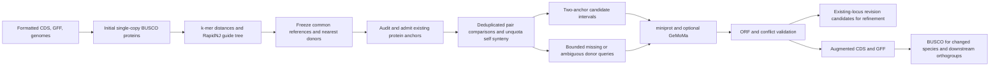

# Synteny-guided gene-model rescue

`workflow/support/rescue_gene_models.py` is an independent, restartable CLI.
Input generation optionally runs it after formatting and initial BUSCO, before
augmented CDS/GFF inputs are used in OrthoFinder. Enable it with
`GG_INPUT_RUN_GENE_MODEL_RESCUE=1`; it is off by default. Evidence-based repairs
of existing CDS models already run during ordinary input formatting, before
longest-isoform selection, independently of this flag. That step exports matching
CDS/GFF corrections and an adjacent `*.cds-normalisation.json` audit while
preserving acquired sources; see [input conventions](input-conventions.md).
The rescue flag controls synteny searches for additional models.

Rescue also exports advisory start/terminal/copy evidence. Optional target RNA,
RepeatMasker and indexed DNA BAM evidence can be audited separately, including
for frozen older runs; see [model evidence](gene-model-evidence.md). Review flags
do not silently change model admission or claim experimentally confirmed function.



## Inputs and reference selection

Provide exactly one formatted CDS FASTA, GFF3 and genome FASTA per species.
Species prefixes and IDs follow [input conventions](input-conventions.md).
CDS-to-GFF mapping is complete and unambiguous; representative isoforms are
selected with the existing synteny mapper. Existing models undergo automatic
anchor admission before comparisons. Original files are never rewritten.
Genome contig names must be unique, and every original coding-feature span and
selected anchor must lie within a matching genome contig, including species with
no candidates. FASTA indexing warnings fail the attempt and remain in its logs.
These checks detect coordinate incompatibility; they do not establish exact
sequence agreement between every original CDS and its genomic exons.

### Existing-model anchor admission

Ordinary stop-free CDS use their original translation under the species' genetic
code. For an invalid translation, two narrowly supported normalisations are
available as a fallback for legacy or externally formatted inputs, applied only
to the temporary anchor protein:

* UTR contamination requires agreement with the same model's annotated spliced
  exons, and a stop-free, in-frame genomic CDS contained within that transcript
  and the supplied sequence. At most two terminal formatter-added Ns and the
  legacy conversion of ambiguity codes to N are allowed in identity comparisons.
  If the supplied sequence matches an annotated CDS, that model takes precedence;
  a shorter ORF in another isoform cannot reclassify its internal stop as UTR.
* Partial CDS require agreement with the same model's genomic CDS and a coherent
  chain of annotated phases. Standard GFF3 skip-count phases and complementary
  frame fields are distinguished from their exon-length recurrence. Ambiguous
  single-block models require unanimous informative evidence elsewhere in the
  source GFF. Missing, inconsistent or mixed evidence cannot establish a frame.
  Only complete codons after the annotated offset are translated; omitted
  terminal bases are recorded. Newly rescued models never establish a source
  file's phase convention.

Translation exceptions, annotated pseudogenes, conflicting reconstructions and
unexplained internal stops are withheld from both anchors and donor queries.
Stops are neither deleted nor replaced with X, and a stop-free alternative frame
alone is insufficient evidence. These records remain in exported CDS/GFF and in
the original-feature overlap checks. Withholding a model is not a gene-loss call.
If no usable anchors remain, preparation fails with its admission audit intact.
New predictions still require the complete ORF and other checks below.

Admission also recognises GeneGalleon's formatted NCBI `GeneID123` identifiers
against `GeneID:123` in `Dbxref`, and GWH gene `Accession` identifiers. These
exact aliases select the public annotation mapper's feature/attribute pair;
full, unambiguous CDS-to-GFF mapping remains required. The general pairwise
synteny command retains its existing strict translation and mapping behaviour.

Admission JSON records the genomic transcript, phase decision, sequence hashes
and reasons for every normalised or excluded representative; a TSV covers all
representatives. The helper's identity and source genome hashes are frozen in
the plan, and admission files participate in prepared/finalized receipts.

All first-pass BUSCO short summaries must contain `C:`, dataset, BUSCO version,
mode and marker count (`n:`). Comparisons require the same dataset/version/mode,
marker count and dataset creation date when present. Matching lineage names
alone cannot distinguish database revisions. Complete BUSCO is
S+D, so WGD duplication does not lower the score. NWKIT `sample --method max-pd`
selects five common references among species with completeness at least 90%.
BUSCO rank breaks equal phylogenetic-diversity gains; it does not define a
weighted quality-diversity objective. Fewer than five eligible species is an
error; change the documented threshold explicitly if appropriate.

Each target also receives its three nearest species by tree distance, with
BUSCO completeness and species name as tie-breakers. Remove self and deduplicate
shared donors and unordered pairs. Every species receives an additional raw,
unquota self comparison. At 500 species this gives at most 4,000 pair assignments
when guide panels agree,
or 5,500 when alternatives are added, before deduplication and 500 self jobs,
compared with 124,750 all-pairs jobs.

The default `GG_INPUT_GENE_MODEL_RESCUE_TREE=auto` builds an unrooted guide
from **pre-rescue single-copy BUSCO proteins**, then uses its branch distances
for both nearest donors and phylogenetically balanced common references.
BUSCO's exact predicted AA sequences are saved before temporary output removal
as `species_busco_full/single_copy/<species>.json.gz`, with table/CDS hashes and
raw predicted IDs. This avoids guessing MetaEuk coordinates from sequence IDs.
Protein IDs must correspond to the full-table match, including MetaEuk's wrapped
reference/contig/strand IDs. Preservation checks that both the tables/CDS and
the raw protein files stay unchanged while reading them. All species must use
the same complete BUSCO marker universe, including missing markers.
Older full/short-table-only runs need BUSCO regeneration to supply these proteins;
no taxonomy substitute is selected silently.

The guide selects up to 200 markers with at least 80% species occupancy,
ordered by occupancy and a deterministic marker-ID hash. Each protein uses
a bottom-256 sketch of amino-acid 5-mers. For every pair, average the Mash-style
distance `min(1, -log(2J/(1+J))/k)` across matching markers, where `J` is the
intersection fraction within the bottom-k sample of the sketch union. Missing
proteins are excluded from the denominator; present proteins with no shared
k-mers count as saturated distance 1. Ambiguous residues break k-mer windows.
Pairs require at least 50 usable shared markers and 25 per diagnostic panel with
defaults. Runs with no informative branch lengths, wholly saturated marker
pairs, or a species saturated against every other species fail instead of
selecting arbitrary neighbours. The error names the affected species. These distances guide
reference choice; they are not calibrated substitution lengths or divergence dates.

RapidNJ uses `-n` to adjust negative lengths. Two interleaved marker panels also
produce trees; their nearest-donor agreement is a sensitivity diagnostic, not
bootstrap support. When panels disagree, retain up to three additional nearest
alternatives from their union (at most six nearest donors with defaults).
Full and panel trees, pairwise distances, selected markers, diagnostics, commands,
timings and SHA-256 receipts are saved under `<rescue output>/guide_tree/`.
Per-species sketches and pairwise distances are verified and reused from a shared
cache. Changes to a verified cache during calculation abort publication;
output files are copied atomically and checked before the completion receipt.
Caches from the earlier unfenced implementation are retained and rebuilt once
under the new cache contract, so a failed computation cannot poison a retry.
Output paths cannot overlap input files. A changed request, including changes
to support-module implementations, requires a new guide output directory. Post-rescue
BUSCO never reselects donors.

| Environment variable | Default |
| --- | --- |
| `GG_INPUT_GENE_MODEL_RESCUE_GUIDE_MARKERS` | `200` |
| `GG_INPUT_GENE_MODEL_RESCUE_GUIDE_K` | `5` |
| `GG_INPUT_GENE_MODEL_RESCUE_GUIDE_SKETCH_SIZE` | `256` |
| `GG_INPUT_GENE_MODEL_RESCUE_GUIDE_OCCUPANCY` | `0.8` |
| `GG_INPUT_GENE_MODEL_RESCUE_GUIDE_MINIMUM_SHARED` | `50` |
| `GG_INPUT_GENE_MODEL_RESCUE_GUIDE_DIR` | `<rescue output>/guide_tree` |
| `GG_INPUT_GENE_MODEL_RESCUE_GUIDE_CACHE` | `<rescue parent>/busco_guide_sketch_cache` |

A C++17 kernel performs sketching and threaded pairwise comparisons; RapidNJ
builds the trees. Container builds record both moving source branches:
[somme89/rapidNJ](https://github.com/somme89/rapidNJ) for x86 and the existing
[johnlees/rapidNJ-M1](https://github.com/johnlees/rapidNJ-M1) ARM implementation.
The exact corresponding sources and licence notices are included in runtimes.
See `workflow/benchmarks/benchmark_busco_guide_tree.py` for a reproducible
synthetic scaling benchmark, which excludes BUSCO execution.

Set `GG_INPUT_GENE_MODEL_RESCUE_TREE` to an external tree to bypass guide creation.
The independent rescue CLI still requires explicit `--tree`; add
`--guide-tree-receipt` to consume the generated diagnostics. Its receipt must
use the same species cohort and nearest-reference count as the rescue plan;
rebuild the guide when either changes. A manually supplied
tree without positive branch lengths uses unit edges and records that choice.
If any non-root edge has a positive length, every non-root edge must have an
explicit length. Root stem lengths do not affect this decision.

The plan freezes all source hashes, genetic codes, thresholds, reference lists,
tool identities (including executable and alignment/annotation source hashes)
and comparison indices. Post-rescue BUSCO never changes this
selection. Changed inputs/settings/tools require a new output directory.

## Candidate and model evidence

Pair comparisons use JCVI/DIAMOND; self comparisons use JCVI/LAST alignment and
raw `kffractbias.selfscan`, with no quota screening. Self alignment removes
same-ID hits, preserves high-identity paralogs and disables tandem collapsing.
Pair alignment also disables tandem collapsing. The selfscan dependency uses
four anchors and chaining distance 20; `--min-anchors` and `--distance` tune
pair comparisons. A successfully scanned pair without anchors is complete
empty evidence, not a failed job or a gene-loss call.
For each chromosome pair within a block, adjacent target anchors define
intervals. Multiple donor anchors at either flank are matched in donor rank
order, maximising matched paths and minimising rank distances; all equally good
matches are retained. This keeps parallel copies when a lifted block combines
WGD segments on the same chromosome. It is a local pairing rule, not an
orthology assignment or a global copy quota. Both target and donor flanking IDs
are recorded. Donor genes between the matched flanks nominate searches.
Both directions of a self block are examined. A donor gene can nominate multiple WGD intervals;
another retained homolog elsewhere does not remove a candidate.

Each distinct interval is searched independently, batching its donor proteins.
This prevents stronger paralogs in other intervals suppressing the local hit.
The default maximum interval is 200 kb and maximum intron is 20 kb; both are
configurable. A large/rearranged/poorly anchored region can remain unexamined.
No candidate or no alignment therefore does not imply gene loss.

The default engine is [miniprot](https://github.com/lh3/miniprot), including its
embedded PAF evidence. Automatic acceptance requires at least 95% donor protein
coverage and 50% identity, an intact start and terminal stop, consistent CDS
phases, canonical GT–AG/GC–AG/AT–AC splice junctions, and no assembly ambiguities,
frameshifts or internal stops. If the predictor omits the terminal stop from CDS,
the actual next genomic stop is added. Incomplete termini may additionally undergo
[bounded genomic completion and donor realignment](gene-model-terminal-completion.md).
The default bound is 300 nt per end; a stop after an already aligned donor end
permits at most two actual genomic amino acids. Hard structural failures remain
failures. True partial models stay in `partial_models.json` and cannot become
intact representatives. Minus-strand
models are reconstructed in transcription order. Coverage is the fraction of
donor residues aligned to genomic residues, including split codons, excluding
query insertions; an alignment spanning both ends is insufficient. Both the
aligned fraction and query-span fraction are retained in model evidence. These are conservative
defaults, not calibrated species-independent sensitivity estimates.

Unresolved queries optionally receive a whole-genome search. Selected donor genes
without a two-anchor nomination are also screened against the existing protein
comparisons; absent, incomplete and copy-ambiguous matches nominate a bounded,
balanced extra queue. The default is 20,000 extra queries per target, and deferred
queries are explicitly recorded. Species profiles can set `max_genome_queries`
without naming individual genes. See [nomination and verified prediction reuse](rescue-additional-candidates.md).

Local and whole-genome miniprot searches explicitly use `--outs=0.5` and `-N30`.
These bounds control discovery; every returned path still passes the independent
coverage, identity, genomic ORF, splice and ownership checks. Each producer hashes
`prediction_search_contract.json` in its receipt and binds it to the frozen plan.
Older whole-genome searches at `--outs=0.99` supply neither positive predictions
nor searched-empty coverage to a new search. Historical local-search reuse
requires an audited repository implementation and executable hash, with the
frozen parent plan and worker receipt checked recursively when predictions were
inherited. Unknown legacy implementations abstain. Raw predictions are checked
again under the current acceptance policy; previous acceptance and support
decisions are never imported.

An outside or unanchored hit can become an intact homologue annotation only with
at least two independent donor species and compatible, unique coding-locus
support. Two paralogs from one donor remain one species of support. These hits
retain `orthology=unassigned` and `expected_copy=unassigned`; annotation is not
evidence that an expected lost copy was recovered. Incompatible or ambiguous
placements remain proposals. No genomic disruption is repaired or masked.

Original ownership uses strand and coding overlap; intron-only or opposite-strand
overlap does not by itself veto an intact coding model. A single existing owner
receives `revision_candidates.json` for the refinement stage's normal donor,
structure and representative-adoption checks. Multi-owner split/merge ambiguity
is withheld. Same-locus alternative paths require at least 80% overlap of the
shorter CDS in the same frame. More nearest-species support, then more donor
species, distinguishes a representative; with equal species support, an identity
advantage of at least 0.10 is required. If that rank is tied but every path is
compatible and the locus has validated support from at least two independent
external donor species, the locus is retained with all paths. The longest CDS,
then coding coordinates, supplies a deterministic primary; it remains explicitly
`representative_status=ambiguous`. Locus support is recorded separately from
each path's own donor support, coverage and identity, including in exported GFF
attributes. Same-donor ties and
incompatible paths remain proposals. Compatible alternatives are additional
transcripts under one gene,
with one primary CDS FASTA record. They are marked as homology predictions and
pass the existing RNA/conservation adoption policy; they are not confirmed RNA
isoforms. Conflicting predictions do not suppress optional refinement.
If refinement later selects a new path, exported `source_rescue_*` gene attributes
preserve the original locus evidence. The new transcript retains only its own
path support; the old representative ambiguity is historical evidence and does
not determine the new path's status. A subsequent catalog import keeps these
two sources of evidence separate. Existing gene IDs are retained.
Identical coordinates from multiple donors are consolidated with each donor's
own coverage and identity. Accepted IDs are stable hashes of genomic exon
coordinates; neither orthogroup IDs nor run order define them.

Optional `--gemoma-jar` / `GG_INPUT_GENE_MODEL_RESCUE_GEMOMA_JAR` runs the
[GeMoMa pipeline](https://www.jstacs.de/index.php/GeMoMa-Docs) for selected donor
transcripts and target regions, using Java and tblastn. It is an explicit local
jar dependency, not downloaded at execution. Select its compatible Java with
`--gemoma-java` / `GG_INPUT_GENE_MODEL_RESCUE_GEMOMA_JAVA`. The official 1.9 jar
uses a JavaScript engine; its absence was reproduced with Java 24, and a
separately selected Java 8 was verified. This requirement should be rechecked when the jar is
updated, rather than changing the container's default JVM. Its CDS models undergo the same
ORF/conflict checks and a donor-protein alignment for coverage/identity. Use
standard genetic code 1 for this optional refinement. Ambiguous reference
transcript mappings and references requiring complementary phase normalisation
are recorded and skipped by GeMoMa; miniprot evidence remains.

## Commands and outputs

```bash
python workflow/support/rescue_gene_models.py plan \
  --cds-dir workspace/output/input_generation/species_cds \
  --gff-dir workspace/output/input_generation/species_gff \
  --genome-dir workspace/output/input_generation/species_genome \
  --busco-dir workspace/output/input_generation/species_cds_busco_short \
  --tree initial_species_tree.nwk --output workspace/output/input_generation/gene_model_rescue

python workflow/support/rescue_gene_models.py run \
  --output workspace/output/input_generation/gene_model_rescue --cpus 4
```

`run` executes all comparison jobs, all species rescue jobs and finalization.
Alternatively use `synteny --task-index N`, `rescue --task-index N` and
`finalize` independently. Indices are one-based and frozen. `status` reports
pending jobs. `--cpus` is the total CPU budget for one CLI worker. Independent
intervals run concurrently within that budget (one thread per interval by
default), with bounded pending work and results collected in input order.
`--interval-workers N` selects fewer concurrent intervals and divides the CPU
budget between them. All genome extraction uses the submitting thread's FASTA
handle. Parallelism across species is supplied by the scheduler.

Whole-genome fallback searches each exactly identical protein sequence once.
`genome_query_mapping.tsv` maps every original candidate to its representative;
`unresolved.fa` retains all original queries and `unresolved.unique.fa` records
the searched queries. Raw unique evidence is in `genome.unique.gff`.
`genome.gff` restores original query order, names and model IDs before the usual
reader and QC. Every candidate keeps its own expected interval, donor/flanks
and acceptance checks, including identical proteins nominated at different loci.

| Output | Meaning |
|---|---|
| `plan.json`, `references.tsv`, `selection.nwk` | Frozen sources, selection and sparse job graph |
| `prepared/SPECIES/` | Admitted proteins, BED, ID map and original-source metadata |
| `prepared/SPECIES/genes.anchor_admission.json`, `.tsv` | Existing-model decisions, evidence and counts |
| `synteny/comparison_NNNNNN/` | Raw anchors, all blocks, commands and logs |
| `rescued/SPECIES/candidates.json` | Donor gene, flanks, interval, orientation and comparison |
| `rescued/SPECIES/models.json`, `audit.tsv` | Accepted, duplicate-support and unresolved models with reasons |
| `rescued/SPECIES/revision_candidates.json`, `partial_models.json` | Existing-locus revisions and incomplete coding evidence, kept separate from new intact genes |
| `rescued/SPECIES/genome_search_nomination.json`, `placement_audit.json`, `prediction_reuse.json` | Extra-query limits, unassigned placement decisions and verified search reuse |
| `effective/SPECIES/` | Validated per-species augmented inputs, ready for BUSCO workers |
| `augmented/species_cds`, `augmented/species_gff` | Original records plus accepted new models |
| `augmented/inputs.tsv`, `summary.json` | Explicit effective input paths and model counts |
| `augmented/anchor_admission/SPECIES.json`, `.tsv` | Admission audits after full export validation |
| `qc_report/before_after.tsv` | Initial/post-rescue BUSCO and changes, after the input-generation QC stage |

Exported FASTA keeps all original IDs, headers and sequences. GFF keeps all
original features, including any embedded FASTA. New transcript/gene IDs follow
the source mapping granularity. Finalization checks full CDS-to-GFF mapping and
frozen genome hashes. Point downstream input directories to the **augmented**
CDS/GFF directories together; using first-pass CDS silently omits rescued models.
The usual input-generation outputs themselves are not automatically installed
into `workspace/input`, and the rescue stage preserves that convention.

Input generation reruns BUSCO only for changed species, in a separate `qc/`
namespace, reusing first-pass tables for unchanged species. The independent CLI
can validate externally generated post-rescue summaries with
`qc --busco-dir DIR --output DIR`. That command checks comparability and writes
the before/after report; it does not invoke BUSCO itself.
QC report inputs and BUSCO summaries are hashed before reading and checked again
before publication. Worker completion likewise freezes model/export/QC files
before checking comparability and rechecks files and dependencies before writing
its receipt. Concurrent replacement therefore cannot publish a completed receipt
for evidence different from that checked.

Per-job locks and hashed receipts support retries. Results are published only
after successful computation; failed attempts retain their logs in `.failed`
directories and leave previous completed output intact. Genomic indexes are
scratch within one species attempt. Successful interval/model evidence persists.
A publication journal records replacement of an existing result and the expected
new job key. After SIGKILL,
the next attempt under the same job lock restores the previous directory or
retains a verified new directory with the matching key and removes its backup.
An invalid new result, including one with another job's receipt, is quarantined.
Unsafe or malformed journal paths fail without recovery writes.
This covers process interruption; power-loss durability is not established.
Comparison receipts bind prepared annotations; model receipts bind comparisons
and prepared annotations. Dependencies are checked again under the stage lock
before reuse and after computation, so replacements during a job invalidate
publication. Finalization also checks frozen inputs after export.
Finalization verifies comparison and prepared-annotation outputs as well as
model receipts. Malformed receipts and receipts belonging to other jobs are
pending work. Effective-input validation errors fail before QC dispatch; final
aggregation reuses verified worker QC even if `overwrite=1`. Array retries
check the full dependency chain, including comparisons repaired successfully
before the retry, instead of trusting a worker receipt alone.

Completed comparisons additionally use a shared content cache, defaulting to
`OUTPUT_PARENT/gene_model_rescue_comparison_cache`. Override it with
`--comparison-cache DIR` or `GG_INPUT_GENE_MODEL_RESCUE_COMPARISON_CACHE`.
Cache keys bind both BED/protein files, species/direction, pair/self mode,
comparison settings, comparison implementation and relevant upstream sources
and binaries, including both `lastdb` and `lastal`. The complete JCVI and
kfFractBias Python implementation and compiled extensions are hashed, so an
editable support-module change invalidates reuse even without a version bump.
Python and the numerical/sorting dependency versions also form part of the key.
Plan IDs, reference-selection changes and unrelated rescue
thresholds do not invalidate identical comparisons. GFF metadata edits can reuse
a comparison only after the new plan prepares and verifies identical BED/protein
files. The full frozen input and per-plan dependency checks remain in force.
Locked, verified cache outputs are copied and rehashed into each plan; writable
files are never hard linked. Corrupted entries are recomputed with the usual
atomic publication and failure diagnostics. Existing results without cache keys
remain valid within their original plan and are not relabelled for another plan.
Updating the implementation/tool identities requires a new rescue output plan;
finish an active plan with its frozen source. Older shared cache entries remain
on disk and cannot match the strengthened keys.

## Array input generation

```bash
python workflow/gg_input_generation_array.py \
  --task-plan /path/workspace/output/input_generation/tmp/task_plan.json \
  --rescue --cpus 4 --memory 32G --max-running 8 --submit
```

Species rescue resources can be set independently from formatting and synteny:

```bash
python workflow/gg_input_generation_array.py \
  --task-plan /path/workspace/output/input_generation/tmp/task_plan.json \
  --rescue --cpus 4 --memory 32G --max-running 8 \
  --rescue-cpus 8 --rescue-memory 64G --rescue-max-running 6 --submit
```

The example permits up to 48 CPUs and 384 GB for species rescue; select counts
that fit the site and other jobs. Omitted rescue resource overrides retain the
existing `--cpus`, `--memory` and `--max-running` behaviour. The independent
interval-worker override is `GG_INPUT_GENE_MODEL_RESCUE_INTERVAL_WORKERS`;
zero uses task CPUs automatically. Scientific defaults are unchanged.

This adds `rescue_synteny` comparison arrays, `rescue_models` species arrays and
`rescue_finalize` after the initial prepare/worker/finalize chain. Initial
finalization is waited on so reference selection and task counts exist before
submission. Use `--rescue-output` for a custom output location. All settings use
the normal `GG_INPUT_*` forwarding registry. External trees, jars and Java
installations must be reachable at their configured paths inside the runtime;
bind an external Java installation as a directory, including its libraries.
`--retry` checks receipts and refuses
submission while rescue jobs are active or scheduler status is unavailable.
Each species worker also performs its post-rescue BUSCO and publishes a receipt
only after both model export and QC succeed; shared finalization verifies/reuses
these outputs. A failed BUSCO therefore cannot make a model worker look complete.
Worker receipt file paths are relative, so the host helper can verify them
even when the container uses different mount paths. The rescue output location
has its own phase lock, including when multiple workspaces share a custom path.
The helper previews submissions without `--submit`. UGE/PBS users can submit
these same core modes manually with their usual one-based task IDs.

This stage recovers supported models and records unresolved evidence. Orthology,
copy-specific loss and ancestral-copy reconciliation belong to downstream gene
trees and synteny analyses. Self synteny alone does not date a WGD or identify a
missing ancestral copy definitively.

For bounded comparisons of serial/parallel intervals and full/deduplicated
genome searches, see [Rescue performance](rescue-performance.md).

## Validation and scale

The runtime tests mask intact/disrupted models, exercise actual WGD pair/self
comparisons on shared and separate chromosomes, and reconstruct split codons in both strands and all three intron
phases. They also test transcript-level CDS/GFF export, corrupted dependencies,
failed publication, dependency replacement during prediction, padded interval
boundaries, conflict-aware refinement, worker QC/retry and a balanced 500-tip reference-selection
plan. The 500-tip test uses tiny synthetic sources; it does not benchmark 500
real plant genomes or establish biological sensitivity/false-positive rates.
Optional GeMoMa 1.9 was additionally exercised with Java 8 on a hidden intact
single-exon model and a minus-strand, two-exon model with a split codon.
Linux arm64 Docker has been tested; SIF execution has not.
Additional tests cover actual SIGKILL at three publication boundaries, corrupted
new outputs and unsafe recovery journals, four concurrent processes publishing
one job, compressed inputs and literal numeric/missing-like contig names, partial
tree lengths, incompatible genome coordinates, duplicate contigs and QC input
replacement. Local donor-flank matching is also checked against exhaustive
ordered assignments on small randomized cases.
Mixed genetic codes are exercised with a code-4 target and code-1 donors,
including an internal TGA that codes for tryptophan in the target, in both local
and whole-genome miniprot searches.

The interval-overlap microbenchmark below measures consolidation only, excluding
synteny and alignment. On `local/genegalleon:rescue-dev-20261003` (image
`sha256:52af7d7cd2756a53fcad19b1b5534e81ef1e6203c7d5f3c1e5a1d0b00cb4773a`),
three repetitions before/after the interval-index change gave median wall times
3.709/0.0122 s (about 300-fold for this operation). Maximum process RSS was
62.5/66.6 MiB, including imports, inputs and copies. The serialized outputs had
the identical SHA256
`eed4fa36ca712a6788d8ac70e35fca007a789c30fab817179f5459fe30c9970c`.
The indexed method trades additional interval storage for fewer comparisons;
these numbers do not predict whole-workflow speed.

```bash
GG_CONTAINER_DOCKER_IMAGE=local/genegalleon:rescue-dev-20261003 \
bash workflow/tests/run_in_runtime.sh python - <<'PY'
import copy, hashlib, json, resource, time
from workflow.support.rescue_gene_models import consolidate
existing = [{'seqid': 'chr1', 'start': i * 100, 'end': i * 100 + 60}
            for i in range(30000)]
models = [{'seqid': 'chr1', 'strand': '+',
           'cds': [[4000000 + i * 100, 4000000 + i * 100 + 60, 0]],
           'problems': [], 'query': str(i), 'evidence': {'i': i}}
          for i in range(2000)]
for _ in range(3):
    work = copy.deepcopy(models)
    start = time.perf_counter()
    output = consolidate(work, existing, 'Plant_species')
    print({'seconds': time.perf_counter() - start,
           'peak_kib': resource.getrusage(resource.RUSAGE_SELF).ru_maxrss,
           'sha256': hashlib.sha256(json.dumps(output, sort_keys=True).encode()).hexdigest()})
PY
```
