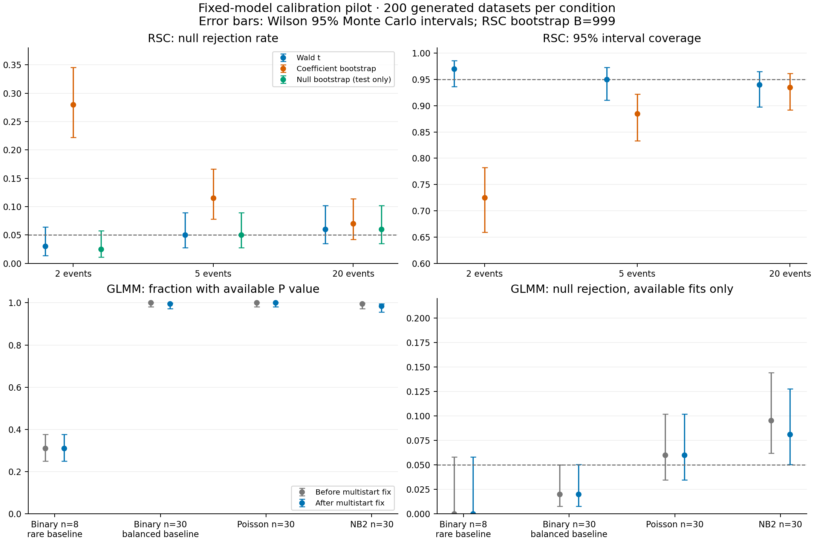

# RSC・コピー数回帰の校正検証（レビュー項目12）

2026-09-10に実施した固定モデルの統計的校正・実装検証の記録。
RSCのWald既定・最小species events=2は維持した。コピー数回帰はNWKITの
95%信頼区間を結果表へ保存するようにした。数値修正は所有元のNWKITで行った。

## 判断

- 少数イベントで現行bootstrapへ一律変更しない。単純なGaussian条件の2イベントで、
  現行係数bootstrapは帰無棄却率28%、公称95%区間の被覆率72.5%だった。
- RSCの既存対策を維持する。イベント等重み、階層化、イベント数に基づくt自由度、
  ランク検査、biological/technical replicate処理、説明変数誤差処理を含む実装を検証した。
- GLMMのoptimizer成功と統計的妥当性を分ける。成功扱いの局所解が帰無モデルより悪い
  例を再現し、NWKITのunpenalized GLMMで複数初期値を検査するようにした。
  大域解や小標本Wald校正を保証する修正ではない。
- コピー数回帰の区間はpointwiseであり、global BH補正済み区間ではない。
  有意判定は引き続きglobal adjusted Pを使用する。

図は各条件200標本のpilot。誤差棒はMonte Carlo 95%区間で、下段の棄却率は
推論可能例を分母とする。独立5,000標本の確認試験は本文に記載する。

## 検証対象と設計

RSCは、指定したreconciliation、共分散、反復観測モデルに条件付けた
発現contrastと形質contrastの係数 `beta=0` を検定する。
コピー数回帰は `trait ~ intercept + log1p(copy_number)` の係数がゼロかを検定する。
binomialはlog odds、Poisson/NB2はlog meanの係数であり、コピー数を応答とするモデルではない。
因果関係・適応・機構の検定ではない。

既存のselectionはnested group CV、学習fold内標準化、同じ木のbaseline、
通常の選択後P値を出さない設計を維持した。連携テストも実行したが、
固定モデルbootstrapが選択過程を校正するという意味ではない。

NWKITの `tools/regression_calibration_design.py` に独立した生成過程・既知真値・
系統共分散を実装し、`regression_calibration_engine.py` から既存推定器を呼んだ。
`validate_regression_calibration.py` はseed、全入力、試行数、失敗理由、
Monte Carlo区間、ソースアーカイブを保存する。
`compare_regression_calibration.py` は修正前後の入力hashを照合し、
`verify_regression_calibration.py` は保存証跡と集計再生成を検査する。

| 実験ディレクトリ（NWKIT `examples/regression_calibration/`） | 生成標本数 | 内容 |
|---|---:|---|
| `smoke-20260910` | 102 | 51条件×2、動作確認のみ、B=4 |
| `wald-pilot-20260910` | 10,200 | 51条件×200、Wald/oracle |
| `bootstrap-pilot-20260910` | 600 | RSC 2/5/20イベント×200、B=999 |
| `tip-pilot-20260910` | 1,400 | raw-tip/reconciliation/反復7条件×200 |
| `glmm-fixed-pilot-20260910` | 4,800 | GLMM修正後24条件×200、修正前と同じ入力 |
| `repeated-bootstrap-pilot-20260910` | 40 | 重複2条件×20、B=199 |
| `rsc-confirm-20260910` | 10,000 | raw 8種とcontrast 7イベントの各5,000標本 |

Wald pilotはイベント数2–50、重複の均等／集中、イベント・lineage分散、
共変量相関0.9/0.99、既知／推定SE、説明変数誤差、MCAR/MAR/MNAR・clade欠損、
二値不均衡、系統分散境界、Poisson/NB2、コピー数観測誤差、ゼロ過剰を含む。
対立仮説の条件をType I errorとは呼ばない。コピー数観測誤差条件は真の係数0.5である。

raw-tipは8種、単一／複数コピー、biological replicate、技術反復の複製、
説明変数の反復、部分欠損、lambda推定を通した。正しい既知の木・reconciliationに
条件付けた試験であり、誤年代・誤reconciliation・組織やbatchの非比較性は全面検証していない。
技術反復の同一観測複製に対する不変性は、同一seedの直接テストでも確認した。

生成標本全体と推論可能例に条件付けた棄却率を併記し、区間提供率、条件付き被覆率、
提供できかつ真値を覆った割合を区別する。不変な二値応答や失敗を再生成しない。
確認基準はMonte Carlo 95%区間が5%検定では0.04–0.06、95%被覆率では0.93–0.97に
収まり、数値失敗率の上限が1%以下であること。pilotだけで適用範囲全体を認定しない。
確認試験は独立master seedを使用した。
設計は[Morrisらのsimulation指針](https://doi.org/10.1002/sim.8086)に沿う。

## RSCの結果

各イベントに1contrast、独立Gaussian誤差、説明変数1つ、真の係数0という条件で比較した。
各条件200標本、bootstrap 999回で、手法間で同じデータを用いた。

| species events | Wald棄却率 | 現行係数bootstrap棄却率 | 帰無モデルbootstrap棄却率 | 係数bootstrapの95%被覆率 |
|---:|---:|---:|---:|---:|
| 2 | 3.0% | 28.0% | 2.5% | 72.5% |
| 5 | 5.0% | 11.5% | 5.0% | 88.5% |
| 20 | 6.0% | 7.0% | 6.0% | 93.5% |

2イベントの28%のMonte Carlo 95%区間は22.2–34.6%。bootstrap回数不足だけでは説明できない。
この単純モデルの係数bootstrapの無限反復極限は推定誤差分散を固定した正規近似に対応し、
真の統計量は自由度 `events-1` のt分布に従う。帰無棄却率は
`2*t.sf(qnorm(.975), events-1)` で、2、5、20イベントでは30.03%、12.16%、6.48%。
分散を各反復で再推定しても、この単純モデルの係数推定値自体は変わらない。

これは現行centered-coefficient P値・percentile区間の結果であり、studentized bootstrapや
帰無制約の検定とは異なる。帰無モデルbootstrapは検証専用で、全階層モデルへの採用を確定しない。
RSCのイベント等重み目的関数は複合目的関数であり、その差に無条件でchi-square分布を当てない。
既知共分散の独立GLS oracleも対照として保存したが、実運用で利用可能な推定器ではない。

重複の追加比較は各20標本、B=199。5イベント×5contrastではWald・係数bootstrapとも
棄却0/20、20イベントで一部に5contrastを集中させた条件では両者とも2/20だった。
各条件3,980回のbootstrap再適合は成功したが、外側標本数20で校正を認定しない。
当該環境の処理時間中央値は1標本約32–34秒で、計算量計画用の観測値であり速度保証ではない。
均等重複の200標本pilotでも棄却0/200という保守的な条件があった。
保守的検定が直ちにType I error制御の失敗を意味するわけではなく、powerの追加確認が必要である。

raw-tip単一コピーpilotの棄却率9%は独立確認で再現しなかった。
8種・7種分化イベント・単一コピー・既知Brownianモデルの5,000標本では、
棄却243/5,000（4.86%、Monte Carlo 95%区間4.30–5.49%）、
被覆4,757/5,000（95.14%、同94.51–95.70%）で事前帯域に収まった。
7イベントのcontrast入力対照も棄却4.66%、被覆95.34%で帯域内だった。
当該条件でのWald校正を支持する結果であり、重複・測定誤差・誤った木へ一般化しない。

20イベントのcontrast-scale説明変数誤差条件は200中7標本で係数情報行列の非正定値エラー。
区間が得られた193標本の被覆率183/193（94.8%）と、全体の提供かつ被覆183/200（91.5%）を
区別する。raw-tip部分欠損で全観測を失ったleafは、optimizer失敗ではなく入力不適格である。

## GLMMの数値修正と残る問題

帰無モデルは係数を0に固定した対立モデルに含まれるのに、次の成功解は帰無より尤度が悪かった。

| smoke replicate 1の条件 | 帰無log likelihood | 修正前の対立 | 複数初期値の対立 |
|---|---:|---:|---:|
| binomial、60種、低いbaseline | -10.64513 | -14.52326 | -10.51413 |
| NB2、30種、真の系統分散0 | -52.43563 | -52.44165 | -52.43479 |

NWKITのunpenalized scalar/categorical GLMMで既存の複数初期値経路をoptimizer成功時にも
適用し、2例を回帰テストにした。二値の例は改善後も系統分散が探索上限に達し、
良好な推論は結論できない。境界・分離・情報行列の診断は維持した。

全4,800組の入力hash一致を確認した。代表的な帰無条件の比較は次のとおり。

| 条件 | P値提供数（前→後、各200） | 推論可能例での棄却（前→後） | 修正後95%区間の被覆 |
|---|---:|---:|---:|
| binomial、8種、baseline 0.05 | 62→62 | 0/62→0/62 | 62/62 |
| binomial、30種、baseline 0.5 | 200→199 | 4/200→4/199 | 195/199 |
| Poisson、30種 | 200→200 | 12/200→12/200 | 188/200 |
| NB2、30種 | 199→197 | 19/199→16/197 | 181/197 |

稀な二値応答の提供率31%は改善していない。NB2修正後の棄却率8.12%のMC95区間は
5.06–12.78%、被覆率91.88%の区間は87.22–94.94%。小標本Wald校正を保証できず、
提供数の減少も記録した。この比較から一般的な校正改善や速度改善を主張しない。

`regression_calibration_laplace.py` は固定した推定パラメータで独立importance-QMC積分と
Laplace近似を比較する。安定した数例のNB2ではlog likelihood差0.1–0.2程度が見られたが、
P値の校正誤差に換算しない。極端な二値・分散境界の例は参照積分自身が安定性基準を満たさず、
その差を精度の確認された参照値として使わない。参照の最適点・SE・被覆率を確立した検査ではない。
近似積分誤差と有限標本推論の区別は[Ogdenの原論文](https://arxiv.org/abs/1808.06341)とも整合する。

## 変更範囲・検証・証跡

NWKITに数値修正、simulation、比較、参照積分、テスト、文書と証跡を追加した。
GeneGalleonはコピー数回帰表へ `confidence_interval_lower`、`confidence_interval_upper`、
`confidence_level=0.95` を保存し、独立GLS計算・TSV往復・欠測・混合familyをテストした。
RSC設定、最小events、Wald・penalty設定、BH補正、selectionのnested CVは維持し、coreの分割はしていない。

GeneGalleon Docker `local/genegalleon:standard-iqtree-dev`（image ID `deca052d1d71`）に
各実験の固定NWKITソースをread-only mountし、`PYTHONPATH`で指定した。
配布イメージへの組み込みビルドやSIF／Apptainer互換性は検証していない。
NWKIT関連テストは重複を除き260件（既存通常234、slow 6、新規20）、
GeneGalleonのRSC・selection連携30件とコピー数Rテストが通過した。
静的Ruff・format・diff検査と保守性hard limitも通過した。全suite・全workflow実データ実行ではない。
ソース配布物を隔離buildで生成し、追加文書・検証ツール・テスト・auditの収録を確認した。
wheelの独立再ビルド比較を含むrelease検証は実施していない。

各実験の `protocol.json`、`records.jsonl.gz`、`summary.json`、`source.tar.gz` を組にして参照する。
7実験の全27,142標本について欠落・重複、seed、入力hash、ソースhash、集計再生成が一致した。
この総数は修正前後や手法間の共有入力を含み、独立標本の総数ではない。
[audit](reviews/2026-09-10-scientific-validity/item-12-artifacts/audit-20260910.json)と
[GLMM対比較](reviews/2026-09-10-scientific-validity/item-12-artifacts/paired-glmm-20260910.json)を併記した。
完全な記録と再現手順はローカルNWKIT `examples/regression_calibration/README.md` にある。

smoke初版のNB2帰無bootstrapにはalpha/size変換の誤りがあり修正済みだが、
そのsmokeは校正の根拠に使わない。Wald pilotはこの参照生成器を呼ばず影響しない。
初版raw-tip pilotの部分欠損7例は記録上 `fit_failed` でも入力不適格であり数値失敗と数えない。
旧protocolのscope文言はraw-tip追加前のため、実行範囲は保存caseとソースに従う。
raw CLI内部bootstrapの試行数は未計測と明示し、再適合失敗の比較は直接engineの記録を使う。

最終確認中に作業用worktreeが外部から削除されたため、変更を通常のGeneGalleonチェックアウトへ
復元し再確認した。他の作業の変更は保持した。コミット・pushは行っていない。
動くupstream branchの既定値をSHAへ固定する変更もしていない。

## 次段階

全ファミリーの多重性は項目8、コピー数・形質の観測過程は項目10・11、
木・年代・reconciliationの不確実性は項目3・4・9と関連する。
個別検定の校正だけでこれらを解消したことにはならない。
代表実データの種数・イベント構造・形質と計算資源から確認条件を事前固定し、
`outer_replicates * (base_fit_time + bootstrap_replicates * refit_time)` に
失敗再試行・帰無と対立の両fitを加えて費用を見積もる。未検証領域は明示したままとする。
