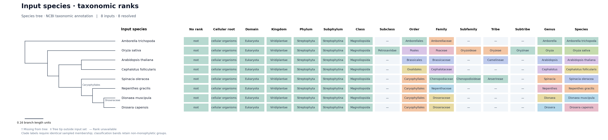
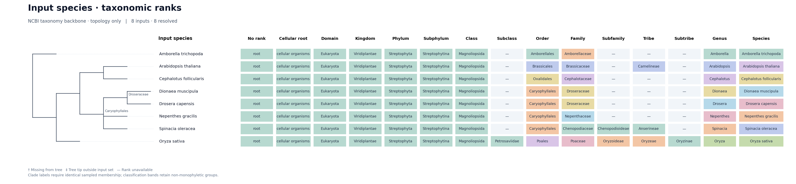

# Input-species taxonomy

Input generation, genome evolution, and gene summary can automatically resolve
NCBI taxonomic ranks and display them alongside the available species tree.
The stage writes `<gg_workspace_dir>/output/species_taxonomy/` (by default,
`workspace/output/species_taxonomy/`). TSV tables, trees, and figures share this
folder in production analyses.

## Configuration

The three entrypoints expose the same settings:

```bash
run_species_taxonomy=1
taxonomy_species_tree="auto"
taxonomy_ranks="all"
taxonomy_plot_clades=0
taxonomy_taxid_map=""
```

Use the entrypoint's ordinary environment prefix, for example
`GG_INPUT_RUN_SPECIES_TAXONOMY=0`,
`GG_GENOME_EVOLUTION_TAXONOMY_RANKS=order,family,genus`, or
`GG_GENE_SUMMARY_TAXONOMY_SPECIES_TREE=/data/species.nwk`.
Input generation runs the shared stage after `single` or `array_finalize`,
not in array workers, dry runs, or download-only runs. Genome evolution runs it
after species-tree inference/dating; gene summary can refresh it independently.
Array settings include the rank selection and any explicit tree/TaxID map.

### Species and TaxID resolution

The current FASTA inputs define the species set; historical rows in the rolling
input-generation summary never add species. Input generation respects its
configured CDS directory, and genome evolution uses its selected CDS/protein
input mode. Gene summary examines `input/species_cds` and `input/species_protein`.
Species keys follow the existing input-name normalization. Where summary keys
match the filename prefix, the longest matching key is retained, including
strain or infraspecific qualifiers.

TaxIDs come from the input-generation species summary when available. Otherwise,
the entire species key (underscores replaced by spaces) is looked up in the
shared ETE database, first as a scientific name, then as a synonym. Ambiguous
matches stay unresolved. Qualified names are not reduced to an unqualified
binomial or genus. Exact named infraspecific taxa can resolve; other cases can
be supplied explicitly in a correction TSV:

```tsv
species	taxid
Arabidopsis_thaliana_accession1	3702
```

Overrides take precedence over summary TaxIDs. Multiple provider summary rows
for one species are merged when their nonempty TaxIDs agree; conflicting IDs
remain unresolved (`conflicting_taxids`) until explicitly corrected. Unknown
override species, duplicate keys in explicit tables/maps, and malformed TaxIDs
are errors. Merged TaxIDs are
translated when recorded in the database. Multiple input identifiers can share
a TaxID and remain separate tips. Invalid/unresolved TaxIDs remain visible in
the table, with the originally supplied ID in `input_taxid`.

Entry points prepare/reuse the existing `downloads/ete_taxonomy/taxa.sqlite`
cache. The analysis does not refresh a second independent taxonomy database.
The database hash and modification time are recorded; modification time is not
a claim about the date of an NCBI release. Update the shared cache through its
normal workflow to use newer taxonomy.

### Tree selection and annotation

Explicit tree and TaxID-map paths are resolved relative to the launch directory.
An explicit `taxonomy_species_tree` must exist and parse successfully. With
`auto`, directories are searched in this order:

1. `output/species_tree/species_tree_summary`
2. `output/species_tree`
3. `output/query2family/parameters`
4. `output/orthogroup/parameters`

Within each directory, the order is `dated_species_tree.nwk`,
`undated_species_tree.nwk`, `dated_species_tree.pruned.nwk`, then
`undated_species_tree.pruned.nwk`. A discovered empty/corrupt tree or broken tree symlink is an error,
not a reason to silently substitute another topology. At least one tip must
match the inputs; missing input species and additional tree tips are reported.
Space/underscore aliases are accepted only when they map unambiguously. Tree
tip names, topology, internal names, support, and branch lengths are preserved.

If no tree exists, the native `nwkit.constrain` backend (`get_taxid_counts`,
`taxid2tree`, and singleton cleanup) constructs an NCBI taxonomy tree from the
same resolved lineages used in the table. No branch lengths are exported for
this tree: its plot shows taxonomy topology, not evolutionary distances or
divergence times. Unresolved inputs are listed below the tree without invented
attachment points. When no TaxIDs resolve, the tables and figure still explain
the result, `tree_available` is false, and the two tree files are empty.

Every tip gets classification properties. A classification gets an internal
clade annotation only when its represented members exactly match that node's
descendant set. This is **monophyly within the displayed sample**, not proof
about unsampled species. Classification groups use TaxIDs, not just names.

The mapping table distinguishes `monophyletic`, `singleton`,
`non_monophyletic`, `unresolved_membership` (unclassified descendants prevent a
decision), and `missing_from_tree`. Missing members and other/unclassified
descendants are listed as JSON arrays. Non-monophyletic or uncertain groups
retain their classification bands but are not assigned to their entire MRCA.
Several ranks can annotate the same node. The plot selects one useful internal
label per node; the tables/NHX retain all selected ranks.

## Output contract

| File | Contents |
| --- | --- |
| `species_taxonomy.tsv` | Persistent `species` key, input/resolved TaxID, resolution source/status, tree match, selected ranks and their TaxIDs |
| `species_lineage.tsv` | All available ancestors from root to terminal taxon, including non-displayed ranks |
| `taxonomy_mapping.tsv` | Rank-to-clade mapping, stable clade identifiers, missing members and discordance |
| `taxonomy_columns.tsv` | Ordered display/table columns, their rank, label, TaxID, and any unresolved ordering constraints |
| `taxonomy_tree.nwk` | Original species-tree bytes, or topology-only NCBI tree |
| `taxonomy_tree.nhx` | Tree with `gg_*` properties, serialized through NWKIT |
| `taxonomy_tree.pdf`, `.svg`, `.png` | Tree and labeled classification bands |
| `provenance.json` | Input/settings/tool/database fingerprints and output hashes |

`species` always identifies the input; the species-rank name is stored separately
as `species_rank`, with `species_taxid` for its TaxID. Rank names follow the
database literally (for example `domain` versus `superkingdom`); missing ranks
are blank, never inferred from another rank. The default `all` discovers the
union of every rank present in the resolved input lineages, including minor
ranks such as subphylum, subfamily, tribe and subtribe, and NCBI labels such as
`clade`, `cellular root`, and `no rank`. A rank is retained even if only one input
species has it. An explicit comma-separated rank list remains supported;
explicitly selected but entirely missing named ranks stay in the table.

### Aligning clades across species

Clade columns are hidden in plots by default. Set `taxonomy_plot_clades=1`
in the workflow configuration, or pass `--plot-clades 1` to the Python helper,
to draw them. This controls only PDF/SVG/PNG rendering: all available clades
remain in the TSV tables, column descriptors, and NHX annotations. Changing
this option regenerates cached plots.

Every observed clade TaxID gets its own column, interleaved with named ranks
using ancestor-to-descendant constraints from all input lineages. For example,
Embryophyta and Tracheophyta precede Class, rosids/malvids precede Order, and the
BOP clade follows Family in the plant example. Sibling clades remain separate
columns; their ordering does not imply that they have an equivalent rank.

The table uses stable identifiers such as `clade_3193` and
`clade_3193_taxid`. A member species gets that clade's name/TaxID; nonmembers
and unresolved species have blank cells (shown as a dash in the plot). Other
clades never shift into those cells. The plot
headings, when enabled, show the clade name and TaxID, so equally named but distinct clades
remain distinguishable. `taxonomy_columns.tsv` provides each column's position,
identifier, label, source rank, and TaxID.

Columns follow lineage precedence, with earliest depth, label and identifier
used for independent-column ties. If named-rank ordering differs incompatibly
between lineages, the deterministic tie-break still retains every column;
`unmet_predecessors` in the column metadata records constraints that could not
be satisfied. A recurrent rank other than clade uses its first occurrence for
column ordering and retains all its values as an ancestor-to-tip JSON array.
Singleton cells stay plain values.

Mapping rows remain one row per rank/TaxID. NHX retains the complete lineage
properties (including the aggregate `gg_clade` property) and adds matching
`gg_clade_<TaxID>` properties to member tips. Thus the table/figure alignment
does not discard source lineage information. NHX property keys replace spaces
in rank names with underscores. Names in NHX properties are percent encoded
only where necessary to protect Newick syntax; decode with URL unquoting.
All-rank figures can be wide; PDF/SVG allow zooming without dropping columns.

Inputs, taxonomy DB, selected tree, implementation, ranks, overrides, and tool
versions form the reuse fingerprint. Output hashes are verified before reuse.
A new species tree therefore replaces a previous taxonomy-tree visualization.
All artifacts are staged before publication. NWKIT's locked output transaction
restores the previous bundle on handled publication errors; this is not a
crash-atomic multi-file filesystem operation. `provenance.json` is written last.

## Standalone use and reproducible example

The helper also accepts an authoritative TSV with `species`, `species_key`, or
`leaf_name`, plus an optional `taxid` column. This is useful for making a figure
without running sequence analyses. Example through the GeneGalleon runtime:

```bash
bash workflow/tests/run_in_runtime.sh python workflow/support/species_taxonomy.py \
  --workspace workspace \
  --species-table workflow/tests/fixtures/species_taxonomy/species.tsv \
  --species-tree workflow/tests/fixtures/species_taxonomy/species_tree.nwk \
  --ranks all \
  --output-dir workspace/output/species_taxonomy_demo/species_tree
```

For the NCBI fallback example, select an empty workspace for tree discovery and
pass the existing shared taxonomy DB explicitly:

```bash
bash workflow/tests/run_in_runtime.sh python workflow/support/species_taxonomy.py \
  --workspace workspace/output/species_taxonomy_demo/empty_workspace \
  --taxonomy-db workspace/downloads/ete_taxonomy/taxa.sqlite \
  --species-table workflow/tests/fixtures/species_taxonomy/species.tsv \
  --ranks all \
  --output-dir workspace/output/species_taxonomy_demo/ncbi
```

The eight-species example uses real NCBI classification from the local cache.
Its supplied species tree and branch lengths are **illustrative test inputs**,
not estimates inferred from sequence data. `lineages.json` in the fixture
directory is a fixed subset for offline tests; production uses the shared DB.



Without a supplied species tree:



Focused container validation:

```bash
bash workflow/tests/run_in_runtime.sh python -m pytest -q \
  workflow/tests/test_species_taxonomy_runtime.py
```
