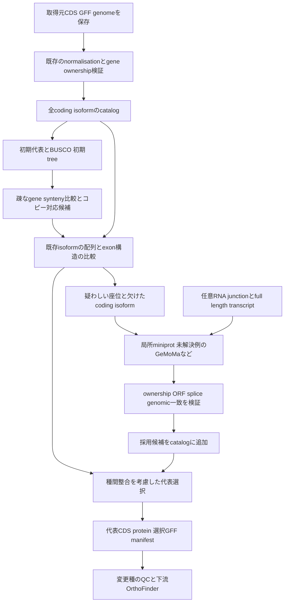

# GeneGalleonでsyntenyを使うgene model修正と代表isoform選択の設計案

調査日：2026年10月5日。現行実装の確認対象：ローカルcheckout `43e3b71faf64`。
本書は実現可能性の調査と実装計画であり、提案するCLI、設定、出力はまだ実装されていない。
計算時間の試算は文献値と明示した仮定に基づき、GeneGalleonの実測結果ではない。

**実現可能であり、最初に実装する価値が最も高いのは、既存isoformから種間で対応するCDSを選ぶ機能である。**
既存gene modelの構造修正と新規isoformの追加も可能だが、syntenyは座位の対応を支える証拠であり、
正確なexon境界や転写産物の存在を単独で証明するものではない。
共通の証拠基盤を作り、代表選択、構造修正、isoform追加を別の判定として段階的に導入する。

## 実現可能性と対象範囲

| 機能 | 実現可能性 | 最低限の入力 | 自動処理の範囲として提案するもの |
| --- | --- | --- | --- |
| 既存isoformの種間整合を考慮した代表選択 | 高い | 全isoformのCDSまたはprotein、geneとtranscriptの対応。synteny併用にはGFF | 信頼できる同一座位の候補から1本を選び、選択理由を保存する |
| CDS開始・終了位置、欠けたcoding exon、splice境界の修正 | 条件付きで高い | genome、GFF、近縁種の信頼できるCDSと構造 | 独立した局所証拠が一致する既存座位内の修正候補を採用する |
| 未注釈のcoding isoformの追加 | 予測は可能。発現の確認には追加証拠が必要 | 上記入力。RNA junctionまたはfull-length transcriptが望ましい | genomeで成立する構造を予測し、RNAで支持されたものとhomologyだけのものを分ける |
| geneのsplitまたはmerge | 難しい | 複数の独立した構造・転写証拠 | 初期版は提案と可視化に留める |
| 全種で同じ完全長isoformを必ず揃える | 保証できない | 入力を増やしても生物学的な消失はあり得る | 対応isoformがない種を明示する |

代表選択だけならgenomeやRNAがない種も扱える。ただし、proteinのみの比較は
「配列として比較可能な代表」の選択であり、splice構造が対応することまで確定しない。
構造修正にはtarget genomeを必須とし、transcriptome由来種へ同じ操作を適用しない。

## 同じisoformの定義

種ごとの `.t1` や `isoform 1` は対応関係を表さない。種間で比較する対象は、対応するgene locusの中で、
相同なcoding exonを同じ順序・読み枠で使い、主要な機能領域が対応するtranscriptである。
genome上の絶対座標、exonの単純な本数、CDSの総長が同じであることだけでは足りない。

最初は**coding isoformの対応**に範囲を限定する。UTRだけが違うtranscriptは同じcoding isoformにまとめて
計算できるが、元のtranscript IDとUTR構造は保存する。逆に、同じprotein配列を作る別のCDS・splice構造は、
protein比較を共有しても構造評価では区別する。

例えばA種に `E1–E2–E3–E4`、B種に `E1–E2–X–E3–E4` と `E1–E2–E3–E4` がある場合、
B種の長い方を無条件に選ぶより、後者を比較用代表にすることに意味がある。
しかしB種に長い方しか存在せずXが本物の種特異的exonなら、Xを除いた人工CDSを作って揃えない。
その種の実在する代表を保持し、比較可能性の限界を記録する。

目的も区別する。機能研究でのprincipal isoform、特定組織のdominant isoform、
系統解析に適した種間対応isoformは一致するとは限らない。
今回の推奨モードは最後の目的を扱い、発現量が最大という主張を付加しない。

WGD、tandem duplication、homeolog、haplotigでは「種あたり1本」にすると別のgeneを落とす。
選択単位は**gene locusあたり1本**であり、orthologまたはco-orthologの対応コピーごとに比較する。
subgenome割り当てがない場合に、syntenyだけでhomeologの由来を断定しない。

## 現行GeneGalleonから分かる実装上の境界

現行の処理には再利用できる部分が多い。ただし「rescueのoverlap判定を弱めれば実現する」という変更は避ける。

| 現行の場所 | 確認した挙動 | 新機能への意味 |
| --- | --- | --- |
| [入力整形](../workflow/support/format_species_discovery.py)の `format_cds` | 補正後の全入力CDSを読み、geneごとに最長CDSを1本保存する。padding前の長さで比較する | 選択前に全候補の配列と構造を保存する必要がある。grouping auditだけでは配列を再選択できない |
| [CDS normalisation](../workflow/support/format_species_annotation/cds_normalisation.py) | 同じtranscriptのgenome・exon・phase証拠からUTR混入やpartial frameの一部を補正する | この既存補正を先に使い、種間投影による構造変更と混同しない |
| [rescue](../workflow/support/rescue_gene_models.py) | BUSCOと初期treeから共通5種と近隣3種を選び、pair/self synteny、局所miniprot、任意GeMoMaを実行する | donor選択、比較結果、座位窓、ORF検証、receipt、ロックを再利用できる |
| rescueの `consolidate` | 既存gene、RNA、CDSのspanとのoverlapを未解決とする。finalizeは元のCDS/GFFへ新モデルを追加する | 既存座位内での修正とisoform追加には、別のgene ownership判定とexportが必要 |
| [pairwise synteny](../workflow/support/pairwise_synteny.py) | mapper内部でも `select_isoforms(..., "longest")` を使う | 全isoformをそのままanchorにすると遺伝子数とgene orderが歪む。gene単位のanchorとtranscript候補を分ける |
| [代表CDS検証](../workflow/support/validate_longest_cds_selection.py) | 最長選択を再計算し、source gene parentを検証する | 従来のvalidatorを残し、新モード用に選択manifestを検証する入口を加える |
| [GFF統計](../workflow/support/gff2genestat.py)、[synteny neighbors](../workflow/support/synteny_neighbors.py)、[CDS resolution](../workflow/support/cds_resolution.py) | GFFから最長transcriptを選ぶ経路がある | FASTAで短いisoformを選んでも、座標・intron・CDS再構成が長い方になる危険がある。選択transcriptを明示して全readerに渡す |
| [gene evolution core](../workflow/core/gg_gene_evolution_core.sh) | GFF情報とCDS store・resolutionを参照する | protein/CDS/GFFを一組のeffective inputsとして扱い、同じgene IDで配列が変わったときもcacheを無効化する |

現行のrescueには原配列と全genomic CDSの厳密一致を一律保証する契約はない。
構造変更を採用する前には、**変更対象transcriptのCDSとgenome再構成の一致**を新たに必須化する。
既存の末端paddingや記録されたnormalisationは区別し、不一致を無理に説明して修正しない。

input generationの出力は自動で `workspace/input` に設置されない。
新機能も同じ慣行を守り、明示したeffective-input manifestまたは選択された別workspace viewで下流に接続する。
既存の[rescue文書](gene-model-rescue.md)と[入力契約](input-conventions.md)を実装時の基準とする。

現行rescueのdonor queryも初期代表proteinが中心であり、候補窓はflank間のdonor geneから作られる。
新機能ではtargetだけでなくdonorの全isoformをcatalogへ保存し、既存geneの不一致からも検索候補を作る。
overlap gateと同時に、候補発見とquery選択の対象を拡張する必要がある。

## 参考になる既存手法

以下は一次論文または開発元資料で確認した手法である。
GeneGalleonへの採用位置と優先度は、本調査での設計判断である。

| 手法 | 既存手法が扱うこと | GeneGalleonでの採用案と注意点 |
| --- | --- | --- |
| [ortho2tree 2024](https://pmc.ncbi.nlm.nih.gov/articles/PMC11165316/)と[公開実装](https://github.com/g-insana/ortho2tree) | orthologと全isoformのMSAからgap distanceを計算し、整合する代表を探す。UniProt reference proteomeに適用された | 代表選択の最も近い先行例。比較baselineとする。protein中心なので、syntenyとexon対応を追加したい。深い分岐へ同じgap基準を一律適用しない |
| [PALO 2013](https://pmc.ncbi.nlm.nih.gov/articles/PMC3590775/) | protein長が種間で近い組み合わせを選び、最長選択による進化解析の問題を評価する | 軽量baselineに適する。同じ長さでも異なるexonを使えるため、最終基準にはしない |
| [IsoSel 2017](https://pmc.ncbi.nlm.nih.gov/articles/PMC5360266/) | alignmentの安定性を利用して系統解析用isoformを選ぶ | family単位の比較baseline。繰り返しalignmentを行うので全genomeの常時処理には計算量評価が必要 |
| [APPRIS 2022](https://pmc.ncbi.nlm.nih.gov/articles/PMC8728124/) | 機能・構造・種間保存性などからprincipal isoformを選ぶ | 信頼できるdonorやreferenceのpriorに使う。対象種、データベース、機能目的が今回の代表選択と同一とは限らない |
| [SplicedFamAlignMulti](https://pmc.ncbi.nlm.nih.gov/articles/PMC9710695/) | CDSとgene配列のmultiple spliced alignmentからexon対応、splicing orthology、モデル改善を扱う | 構造を比較するための直接的先行例。初期版の必須依存にせず、難しいfamilyの精査と精度baselineに使う |
| [GeMoMa 2018](https://link.springer.com/article/10.1186/s12859-018-2203-5)と[開発元説明](https://www.jstacs.de/index.php/GeMoMa) | amino acidとintron位置の保存性、任意RNA証拠を使うhomology-based prediction。複数reference transcriptに対応する | 現行の任意エンジンを活用し、未解決の局所修正・coding isoform投影へ拡張する。RNA不在と反証を区別する |
| [miniprot 2023](https://academic.oup.com/bioinformatics/article/39/1/btad014/6989621) | proteinをgenomeへsplice・frameshiftを考慮して高速にalignする | 既存依存を使った候補生成の主エンジン。alignmentの成立だけでは真の転写産物や正しい全exon構造を保証しない |
| [LiftOn 2025](https://genome.cshlp.org/content/35/2/311) | LiftoffのDNA alignmentとminiprotのprotein alignmentを組み合わせてannotation transferを改善する | 近縁種または同種assembly間の有力な比較対象。proteinを最大化する処理をそのまま採用せず、実在する破壊や種特異的変化の保存を確認する |
| [TOGA 2023](https://pubmed.ncbi.nlm.nih.gov/37104600/)と[TOGA2](https://github.com/hillerlab/TOGA2) | genome alignmentに基づくorthology、exon projection、intact/lostなどの判定 | chainが既にあるcohortには有力。gene-level JCVI syntenyは必要なgenome chainの代替にならない。開発元はTOGA1からTOGA2への移行を案内し、TOGA2の[2026年報告](https://pubmed.ncbi.nlm.nih.gov/42427682/)はpreprintである |
| [Comparative Annotation Toolkit 2018](https://pubmed.ncbi.nlm.nih.gov/29884752/) | Cactus等のgenome alignmentを使い、clade内annotationとisoformを比較・改善する | 多種comparative annotationの先行例。全genome alignmentから新規に導入する構成は、今回の軽量拡張より大きな別プロジェクトになる |
| [PASAとEVidenceModeler 2008](https://pmc.ncbi.nlm.nih.gov/articles/PMC2395244/) | transcript alignmentを使った既存annotationの更新、exon変更、isoform追加など | RNA-supported refinementの参考。全処理を初期版に内蔵せず、検証済みtranscript/GFFを証拠として取り込む |
| [Mikado 2018](https://pmc.ncbi.nlm.nih.gov/articles/PMC6105091/) | 複数transcript assemblyを整理し、coding・junction・homology証拠からprimary/alternative modelを選ぶ | RNA由来候補を整理する参考。種間で同じisoformを選ぶ部分は別途必要 |

特にortho2treeは、約14万のcanonical proteinを8哺乳類で調べ、7,804件のcanonical変更を提案したと報告している。
「最長以外を種間整合から選ぶ」方針には実運用の先行例がある。一方、その検証をそのままWGDの多い植物や
深い分類群全体の精度保証には使えない。[ortho2tree論文](https://pmc.ncbi.nlm.nih.gov/articles/PMC11165316/)

## 推奨する処理構成

まず独立したrestartableなPython CLIを `workflow/support/` に置き、
入出力と検証が固まってからinput generationの既存coreへoptional stageとして接続する。
core shellの関数や実行stageを別のshell fragmentに分割する変更は必要ない。

missing-gene rescueとの統合は、まず同じ凍結済み比較結果を読む形にする。
rescueを同時実行する場合、新規rescueモデルもcatalogへ追加し、最終代表選択の対象にする。
現行rescueの「既存モデルと重なる新geneは採用しない」という契約は維持する。
refinementは所有geneが確定した座位内の候補を扱い、両者のexportを1つの最終manifestへ統合する。

最初から最終OrthoFinder結果を必須にすると、代表選択後にOrthoFinderを行う順序と循環する。
初期の対応はgene位置、近傍anchor、配列homologyで構築し、必要な場合だけ初期代表による軽いfamily分類を使う。
その初期分類を最終的なorthologyの真値とは扱わない。
安定した1対1コピーから始め、コピー対応が曖昧なfamilyは提案に留める。

一度の追加候補生成と再選択を基本とし、選択が変わったからといって全syntenyを毎回再計算しない。
初期anchorとdonorを凍結し、必要な局所更新を別receiptで記録する。
追加roundを許す場合も回数を制限し、変更が循環したfamilyを未解決として報告する。
新しい予測を独立donor証拠として同じrun内で自己増幅させない。

## 全isoform catalogと座位対応

catalogには、正規化gene ID、元gene ID、元transcript ID、内部candidate ID、species、assembly識別子、
contig、strand、CDS blocks、phase、exon blocks、CDS/protein hash、normalisation状態、
完全長/partial/translation exception、annotation source、任意RNA証拠を保存する。
FASTAの配列とGFFの転写産物が1対1に対応しないrecordは、理由を付けて隔離する。
GFFだけから候補を復元するときはgenomeから抽出し、取得元配列とは別のprovenanceを付ける。

全isoformのcatalogとgene単位のsynteny anchorは別のデータである。
長いisoformにだけ依存してanchorが壊れる問題には、検証済みの別候補をanchorとして使う追加モードを検討する。
その場合は初期代表、anchor代表、最終解析代表をそれぞれ記録し、既存rescueの入力hashを偽装して再利用しない。
同じgeneに10 isoformあってもBED上のgene orderは1 locusで数える。

既存synteny結果を再利用できる条件は、genome/annotation、gene grouping、anchor配列、比較設定、tool identity、
出力receiptが一致することである。名前が同じdirectoryに結果があるだけでは再利用しない。
ただし最終representativeの変更だけで、凍結した初期anchorの比較まで無効化する必要はない。

gene対応graphにはanchorの位置・方向、両側flank、block、相互の配列support、コピー曖昧性を保持する。
単純なconnected componentは、1本の誤ったedgeでWGDコピーを融合させるので、そのまま選択単位にしない。
相反する対応を検出し、局所コピーごとのgroupまたは複数仮説を保持する。
target gene自身がanchorとして使われた場合、その同じedgeを構造修正の独立証拠に重複計上しない。

遠い共通referenceはgene位置の支えとして使えても、isoform構造を修正するdonorには不向きなことがある。
donorはgene単位で完全長、構造一致、assembly gap、translation exception、転写証拠を評価する。
species全体のBUSCOは候補選別に使うが、個々のgeneの正しさを保証するscoreにはしない。

## 代表isoformの選択アルゴリズム

候補を選ぶ前に、gene ownershipの不一致、明らかなframeshift、説明できないinternal stop、
genome不一致などを評価する。異常なrecordを消して成功扱いにせず、元データと理由を保存する。
partialしかないgeneはpartialであることを保ち、短い完全ORFを探して完全長というラベルに置き換えない。

最初の実装では、近縁の対応コピー間で以下を比較する。

| 評価するもの | 提案する評価方法 | 避ける誤判定 |
| --- | --- | --- |
| proteinの対応 | bidirectional aligned coverage、保存領域の一致、内部の長い未対応領域 | 短い断片の高identityを完全長より優先する |
| coding exonの対応 | aligned protein/codon位置へexon境界を写し、junction位置とphase、exon使用順を比較する | exon本数やprotein長だけが同じモデルを同一視する |
| locus | synteny、flank方向、対応コピー、競合gene | protein best hitだけで別paralogへ乗り換える |
| 完全性 | 開始/終止、reading frame、assembly gap、主要領域のcoverage | 全種を短いcommon fragmentに揃える |
| 機能領域 | 任意の既存Pfam/domain annotation、実験的principalなど | 複数種で共通するという理由で必須domainを落とす |
| RNA | target種のjunctionとtranscript support | 未採取の組織で発現しないことを「存在しない」と扱う |

提案する目的関数は、各geneの候補品質と、対応geneの候補間整合を組み合わせるものとする。

`J = Σg Qg(selected_g) + λ Σ(g,h)∈E wgh Cgh(selected_g, selected_h)`

`Q` はその種のgenome・annotation・RNAに対する品質、`C` はproteinとexon構造の対応である。
hard gateに違反する候補はscoreで救済しない。係数、score margin、採用閾値は
held-outデータで決める設計項目であり、本書で科学的な既定値を確定しない。

gapの少なさだけを最大化すると、全種で短いisoformを選ぶ解が有利になる。
そのため、信頼できる完全長template群の主要領域coverageと、候補ごとの独立品質を制約する。
複数の本物のisoform群が保存されている場合には、群を先に分けて比較し、
geneごとの選択がどの群を代表するかを記録する。

全組み合わせの探索は行わない。初期版は独立品質の高い複数のseedから、
固定済みpairwise scoreを使った座標更新を行うheuristicとする。
小さい問題では全探索してheuristicを検証し、最良解を保証するという説明はしない。
同点では元の候補と安定したIDを用いて決定し、input順序やthread数で結果が変わらないようにする。

最良候補と次点の差が小さいgeneは `insufficient_evidence` または `conflicting_evidence` として扱う。
下流が必ず1本を要求する場合は従来代表を保持できるが、
「種間で対応するisoformが選べた」という集計には含めず、保持した理由をmanifestに記録する。

候補scoreは近縁の少数donorとの比較を優先し、深い分岐にはcladeごとのtemplateを使う。
多数の種を含むcladeが投票を独占しないよう、cladeを代表するdonorへ重みを分配する。
全部の種を同じ生物学的isoformへ強制しない。複数群、対応不足、種特異的構造を結果として保持する。

全種で唯一の代表setを必要とする下流には、globalな代表manifestを発行する。
特定familyの詳細解析では別のfamily-specific manifestを発行できる設計が望ましい。
familyごとの選択結果でglobal setを暗黙に書き換えない。

## 構造修正とisoform追加の判定

既存モデルとdonor構造の不一致は候補発見に使うが、不一致そのものをannotation errorと決めない。
まず既存catalog内に適切なisoformがあるか確認し、ある場合は再選択だけで解決する。
それでも欠けている場合に、所有geneの局所領域へdonor transcriptを投影する。

局所領域はtarget gene、近傍gene、synteny flankから作り、隣のgeneへ侵入しない探索境界を記録する。
現行rescueの200 kb interval、20 kb intronという既定値はrescueの契約である。
長いintronを持つ分類群を対象にする新モードでは、対象に合わせて明示した設定を用い、
探索範囲外のgeneを陰性と数えない。

候補生成はminiprotを第一段階とし、未解決例だけGeMoMa、近縁assemblyならLiftOn、
既存chainがある場合ならTOGA2/CESAR系の投影を比較する。
同じ座位を複数donorの対応isoformで調べ、全isoformを全genomeへ無制限に投げない。
RNA-supported GFFやtranscriptを取り込むadapterは設けるが、初期版にRNA assembly pipeline全体を内蔵しない。

| 操作 | 自動採用のために提案する条件 | 初期版での扱い |
| --- | --- | --- |
| 既存transcriptのCDS境界を変える | target genomeから完全一致で再構成でき、ORF/phase/spliceが成立する。複数の適切なdonorが一致し、強い反証がない | 元transcriptに代わるrevision候補として保存する |
| 欠けたcoding exonを足す | 同じlocus内でexon対応が成立し、target配列・splice・reading frameが支持する | RNAがない場合はhomology-supported refinementと明記する |
| alternative coding isoformを追加する | existing gene ownershipが確定し、既存候補と異なる実在可能なcoding pathを持つ | RNA-supportedとhomology-predictedを別statusにする |
| startまたはterminal exonを変える | 局所genomeと独立した開始/終了または転写証拠が支持する | 新規splice pathより慎重に扱い、UTR/TSSを推定したと主張しない |
| splitまたはmerge | gene間境界、コピー、transcriptが独立証拠で判定できる | 初期版ではreview proposalに留める |

複数donorと複数predictorは同じreference配列やalignmentに由来する場合がある。
「2票だから独立証拠2つ」とは数えず、donorの系統偏りと証拠の共有元を記録する。
RNA junctionがすべて存在しても、その組み合わせが1本のtranscriptに共存するとは限らない。
full-length long readはその判定に特に有用だが、mapping、chimera、端の完全性も評価する。

元モデルの強いRNA supportと矛盾する新候補は、近縁種へのsimilarityが高いだけでは採用しない。
実在するpseudogene、assembly gap、frameshift、translation exceptionを「正常化」しない。
genomeの塩基を編集せず、削除やXへの置換でstopを隠さない。
retained intronや非canonical junctionは直ちに偽物とはしないが、保守的な自動採用対象から外して証拠を残す。

初期の状態分類案は `selected_existing`、`accepted_refinement`、`rna_supported_isoform`、
`homology_predicted_isoform`、`ambiguous_copy`、`insufficient_evidence`、`conflicting_evidence`、
`assembly_limited` とする。これは「真のgene loss」を判定する機能とは独立している。
homology-predicted isoformをcatalogへ保存することと、それをrepresentativeに採用することは別gateにする。

## IDと出力の契約

既存gene IDを保持し、選ばれた配列のheaderは現在のgene-level形式を維持する。
代わりに、**gene IDだけではどのtranscriptを使ったか分からない**ため、選択manifestを必須にする。
元transcriptは不変のsourceとして保存し、修正候補には新しいrevision IDを付ける。
予測IDにはassemblyの同一性、strand、CDS blocksとphase、配列identityを含め、run順序やOG番号から作らない。

提案する出力namespaceは `output/input_generation/gene_model_refinement/` とする。
既存の `gene_model_rescue/` や `species_cds_resolved/` を上書きしない。

| 提案する出力 | 内容 |
| --- | --- |
| `plan.json` | 入力hash、code、donor、copy対応、設定、engine identity、job割り当て |
| `catalog/SPECIES/` | 全候補のCDS/protein、構造、元IDと候補IDの対応 |
| `locus_correspondence.tsv` | gene間の対応仮説、synteny証拠、曖昧性 |
| `evidence/` | 局所投影、alignment、RNA証拠、候補比較のscore成分 |
| `decisions.tsv` | original/selected transcript、操作、confidence成分、対立候補、理由 |
| `representative_map.tsv` | species、gene ID、candidate ID、source transcript、配列と構造hash |
| `refined/species_gff/` | 元annotationと採用されたrevision/追加候補の完全な履歴付きview |
| `effective/species_cds/` と `effective/species_protein/` | gene locusごとに選択された1本の配列 |
| `effective/species_gff/` | 下流が選択transcriptの構造を確実に使うGFF view |
| `effective/inputs.tsv` | CDS/protein/GFF/genome/representative mapを一組として指定するmanifest |
| `qc/` | before/after、未解決数、変更理由、validationとruntimeの記録 |

full annotationのviewとrepresentativeのGFF viewを分ける。下流mapperが従来の最長規則でも
意図した候補を誤選択しないviewを用意しつつ、reader側にもexplicit transcript selectionを実装する。
代表用viewから外したtranscriptが元annotationから消えたという意味にはしない。
shared CDS featureの複数Parent、同座標の別gene、minus strandを保持できるwriterが必要になる。

全isoformをOrthoFinderやBUSCOへ渡して見かけのduplicationを増やさない。
BUSCOは代表setと、必要なら別名の候補catalog QCを区別し、集計単位を明記する。
新規transcriptの発現値を同じgeneの既存値やdonorの値から捏造しない。
gene-level expressionはgene IDで接続し、isoform expressionは専用対応とtarget種のquantificationがある場合だけ使う。

## 計算量と計算時間の試算

記号は、種数 `S`、1種のgene数 `G`、平均候補数 `k`、gene単位のdonor数 `d`、
比較対象geneの割合 `f`、構造予測が必要なgene数 `Nflagged` とする。

全種pairは `S(S−1)/2` で、500種なら124,750pairになる。
現行rescueの共通5種と近隣3種なら、dedup前のpair割り当て上限は `8S`、追加self jobは `S` である。
500種で最大4,000pairと500selfという構造を維持すれば、全pair再計算を回避できる。
これはjob数の上限であり、500の実genomeを実用時間で処理できたという実測証拠ではない。

代表選択のpairwise score評価数は、疎な対応graphで概ね `O(S G f d k²)` となる。
1候補あたりのalignment費用は配列長・実装で変わるため、この式だけで秒数には変換できない。
例として50種、30,000gene、曖昧なgeneを20%、8donor、両側3isoformと仮定すると、
保守的に数えた比較要求は2,160万件、500種なら2億1,600万件である。
全gene比較なら各5倍となる。単にisoform比較だから安いと断定できない。

実用的な削減は、単一候補geneを飛ばす、同一配列scoreを共有する、
gene内のprotein同一候補を構造classに分けて計算共有する、曖昧geneだけ詳細比較する、
まず少数の高品質templateへ比較し競合時だけdonorを増やす、family/profile単位で処理する、という順で行う。
候補のpruningで長いものだけを残すと目的を壊すため、splice pathの多様性と独立品質を保つ。

構造予測の入力規模は、原則として `Nflagged × selected donor isoforms` に制限する。
50種各30,000geneの5%を調べる仮定では75,000 target locusである。
同じgeneの20kb窓でも、起動時間、query数、長いintron、反復配列、二次候補数で時間は変わる。
局所窓を1つずつ処理する現行の利点は、強いparalogが他窓の候補を抑えないことである。
将来batch化する場合も、window IDごとに候補を分離し、その性質を保つ。

文献上の速度目安として、miniprot論文Table 1には、25,007本のzebrafish proteinをhuman genomeへ
alignするケースで267秒、peak RAM 21.8 GBという結果がある。
同表のGeMoMaは8,718秒、146.9 GBであった。
これは論文当時の特定入力・実行条件の比較であり、既存GeneGalleonの局所rescue、
新機能のend-to-end処理、現在のreleaseやCPUでの速度保証ではない。
速いprotein alignmentの先行例がある一方、engine選択とRAM budgetingが重要だと分かる。
[miniprot論文](https://academic.oup.com/bioinformatics/article/39/1/btad014/6989621)

新規synteny計算の負荷を見積もるための**仮定による感度分析**を以下に示す。
pairとselfがいずれも平均10分または60分、各jobが4 CPUを要求、
16 jobを並列実行できて実効稼働率70%と仮定した。
RAMやscheduler queue待ちがこの並列度を許すという追加仮定も含む。
平均job時間は測定値ではなく、読者がpilotの測定値へ差し替えるための入力である。

| 種数 | job数上限 | 仮定した平均job時間 | 総worker時間 | 要求CPU時間 | 仮定から求めた経過時間 |
| --- | --- | --- | --- | --- | --- |
| 50 | 450 | 10分 | 75時間 | 300 CPU時間 | 約6.7時間 |
| 50 | 450 | 60分 | 450時間 | 1,800 CPU時間 | 約40時間 |
| 500 | 4,500 | 10分 | 750時間 | 3,000 CPU時間 | 約67時間 |
| 500 | 4,500 | 60分 | 4,500時間 | 18,000 CPU時間 | 約402時間 |

要求CPU時間は実際に使用したCPU timeとは違う。I/O待ちや低いthread効率でも要求枠は占有する。
この表にはcatalog、代表選択、投影、BUSCO、OrthoFinder、queue待ちを含めていない。
既存syntenyを完全に再利用できるrunでは、この表の新規比較費用を除ける。

pilot後の推定はstage別に行う。
`T ≈ Tcatalog + Tnew_synteny + Tisoform_score + Tlocal_prediction + Trefinement + TQC` とし、
各stageの実測worker時間を並列数と稼働率で換算する。
窓長、query長、exon数、copy数、RNA evidence量ごとに層別し、中央値だけでなくp95と最大値を記録する。
種数だけから一律の「数時間」を約束しない。

full-length protein、genome hash、GFF、alignment score、decisionをstage別cacheで管理し、
engine更新・入力変更・設定変更で影響stageを無効化する。
genome indexはspeciesごとに管理し、同じcompressed genomeを多数workerが重複展開しない。
小さいfamilyをまとめてschedulerへ投入し、大きいfamilyや長いgeneは別resource bucketへ分ける。
RAM制約下の並列度も測定して決め、CPUだけで同時job数を設定しない。

## 精度と速度を確認するpilot

最初のpilotは3種を含む小さな構造fixtureと、5から10種の近縁な実genome cohortで行う。
現行rescueのreference数要件を使うrunでは必要種数を満たすか、明示した設定を用いる。
reference不足を黙って無視する経路は作らない。
さらにWGDまたはtandem duplicationを含むcohortと、深い分岐・fragmented assemblyを含むcohortを追加する。
実データの選択は対象プロジェクトに合わせる。分類群とassembly品質が未指定なので、本書では固定しない。

評価対象は、single-isoform、既知の複数isoform、同長の異なるexon、完全ORFの誤ったモデル、
terminal exon差、欠けたexon、intron retention、microexon、WGD/tandem copy、assembly gap、
true pseudogene、強い種特異的変化を含める。

合成破損は、正しいtarget annotationのexon削除、境界変更、誤split/merge、代表の取り違えで作る。
対応isoformのtarget annotationを隠してrescueできるか調べる一方、
donorやscore tuningへ隠した正解を混入させない。
別gene family・別species・別cladeをhold-outにしてthresholdを評価する。
公開高品質annotationにも誤りがあるので、RNA・long read・curated recordを独立証拠として使う。

| 評価項目 | 測る内容 |
| --- | --- |
| 代表選択 | 既知の対応coding isoformの正答率、変更率、未解決率、cladeとcopyごとのcoverage |
| 構造修正 | 正確なCDS block/phase/junctionのprecisionとrecall、既存正解モデルを壊した率 |
| isoform追加 | 完全なcoding pathの一致、target RNA支持、homologyのみの予測割合 |
| 誤ったコピー | paralog、homeolog、隣接geneへ移った割合 |
| 生物学的保存 | 本物の種特異的exon、gene loss、破壊、domain差を消していないか |
| 下流解析 | codon alignmentの利用可能site、gene treeの変化、dN/dS等の感度。望むtreeへの一致だけを正解基準にしない |
| QC | BUSCOとgene数。BUSCOが上がるだけでisoform構造が正しいとは判定しない |
| 速度 | end-to-end wall time、stage別CPU time、peak RSS、disk、cold/warm cache、retry費用、job tail |

代表選択のbaselineはlongest、provider canonical、PALO、ortho2treeとし、
小さなfamily subsetでIsoSel/SFAMも比較する。
構造修正は現行normalisationとrescue、局所miniprot、GeMoMa、入力条件が合うLiftOnなどを比較する。
「精度の良いmethod」と「都合の良いmethod」で別の正解データを使わず、
同じmask、target locus、出力検証、resource条件で測定する。

さらにproteinだけ、proteinとsynteny、proteinとexon構造、全証拠というablationを比較する。
これにより、改善が単なる短い配列の選択によるものか、syntenyによるコピー対応の改善か、
exon対応の追加が効いたのかを区別する。geneが同じでも誤ったisoformを選ぶケースと、
別paralogを選ぶケースは別に数える。

採用gateは実装前に定義する。
既存正解geneを変更した率、wrong-copy率、homology-only候補のprecision、
held-outでの代表選択の改善、計算資源予算を確認し、変更数の多さを成功基準にしない。
最低precisionなどの数値は許容リスクとpilotから決める。
precisionの主張にはconfidence intervalを付け、auto採用を狭めたときのcoverage低下も報告する。

## 段階的な実装計画

| 段階 | 実装範囲 | 完了の判定 |
| --- | --- | --- |
| 0 | 全isoform catalog、explicit gene/transcript map、選択manifestとreader契約 | 元CDS/GFFの再現、選択前の候補保存、ID collision検出、従来longest modeの挙動維持 |
| 1 | 既存候補だけを使う代表選択。安定したコピー対応から開始 | 構造変更なしでbaselineより対応選択が改善し、FASTA/GFF/下流readerが一致する |
| 2 | 既存モデルのauditと局所projection。自動置換前にproposalを出力 | 過剰修正とwrong-copyを測定でき、修正対象のgenomic一致と構造検証が通る |
| 3 | 保守的な修正採用とRNA-supported coding isoform追加 | 元モデルの履歴を保ち、RNA/homology statusを区別し、代表採用を別gateで制御する |
| 4 | homology-only候補の選択拡張、WGDの難例、任意heavy engine、family-specific mode | 独立cohortで精度とresource budgetが確認できる |

初回releaseは段階0と1に絞る。
これは通常のgene modelを動かさず、最長選択が原因の比較上の問題を改善できるため、
scientific riskと検証範囲を限定しながら効果を測れる。
最終目標として全機能を扱うが、代表選択の品質が未確認のままannotation修正まで同時に公開しない。

提案するCLI名は `gene_model_refinement.py`、subcommandは `plan`、`catalog`、`correspondence`、
`select`、`predict`、`finalize`、`status`、`qc` とする。いずれも未実装である。
各subcommandは1-basedの凍結job index、receipt、ロック、atomic publication、失敗logに対応する。
現行rescueから内部関数を直接importする部分は、公開契約か否かを明確にしてから使う。
単に長いファイルを分割するためのcore再構成は行わない。

設定案は、代表選択 `longest|conserved`、refinement `off|audit|conservative`、
RNA evidence manifest、再利用するsynteny plan、donor/資源上限を中心とする。
`longest` と `off` を互換defaultにし、新モードをopt-inで提供する。
新設定はentrypoint editable block、forwarding registry、core、array planner、docsへ一貫して加える。
既存のthresholdを変更して新テストを通すことはしない。

初期依存は既存のminiprot、MAFFT、Python/GFF mapperと任意GeMoMaで足りる構成を目指す。
ortho2tree等はまず評価baselineとし、package自体の必須化と手法の利用を混同しない。
新しいupstreamをcontainerへ追加する場合はmoving source branch方針に従い、
固定version/commitをrepository defaultに埋め込まず、実行時の解決identityをprovenanceに記録する。
依存側の不具合はその依存側で修正し、GeneGalleonの採用gateを弱くする回避策を作らない。

## 変更箇所と検証の接続

主要な変更先は、入力formatter、annotation mapper、代表選択validator、
synteny preparation、GFF statistics、CDS resolution、effective-input consumer、
input generation entrypoint/core/array helperである。
最終OrthoFinderの入口は[genome evolution core](../workflow/core/gg_genome_evolution_core.sh)で確認し、
gene evolution/query2familyのCDS store、annotation、expressionとの整合を別途検証する。

formatting、catalog、synteny、selection、prediction、QC、下流のprovenanceを分離し、
同じgene IDの選択配列が変わったときはsequence store、protein search DB、OrthoFinder、alignment、
tree、codon解析など影響するcacheが旧配列を使わないようにする。
全新機能を有効化しただけで無関係なdownloadやtrait tableを作り直す設計は避ける。

既存テストの接続先は、[formatting](../workflow/tests/test_format_species_inputs.py)、
[longest validator](../workflow/tests/test_validate_longest_cds_selection.py)、
[GFF statistics](../workflow/tests/test_gff2genestat.py)、
[rescue runtime](../workflow/tests/test_rescue_gene_models_runtime.py)、
[pairwise synteny](../workflow/tests/test_pairwise_synteny.py)である。
新しい純粋な候補比較テストと、実engineを呼ぶruntimeテストを分ける。
符号、座標系、全3phase、split codon、genetic code、同長候補、shared Parent、
同座標の別gene、literal ID、既存sequence/GFFの不一致を必須caseとする。

restart検証には壊れたreceipt、候補生成中の入力交換、finalize失敗、SIGKILL、
同じjobへの並行worker、選択manifestの取り違えを含める。
旧normalisationとrescueのテストを弱めず、full-outputのproducerとreaderを同時に確認する。
初期版では、coding isoformの単なる再選択でgene copy数が増えないことをend-to-endで確認する。

実行チェックの選択は既存の[Development and Tests](development-and-tests.md#choose-checks-for-a-change)、
[runtime policy](agent-runtime-validation.md)、[validate-change](../.agents/skills/validate-change/SKILL.md)に従う。
性能測定には[benchmark-performance](../.agents/skills/benchmark-performance/SKILL.md)を用い、
同じ生物学的評価条件と入力を保つ。ここに第二のtest runnerや独立した実行手順は作らない。
Dockerで通過してもSIF互換を主張せず、両runtimeの実行結果を区別する。

## 実装前にpilotで確定する事項

対象分類群と分岐の深さ、種数とgene数、全isoformの取得可能性、genome/GFF/CDSのrelease一致、
RNA evidenceの有無、WGD/subgenome情報、利用可能CPU/RAM/storage、
代表setをglobalにするかfamily単位にも持つかを確認する。
これらが未指定でも段階0と1の設計は進められるが、構造修正のthresholdとwall timeは確定できない。

特に、最長CDSしか保存していない入力から、元のalternative transcriptを必ず復元できるとは限らない。
source GFFとgenomeまたはall-transcript FASTAがないspeciesでは、候補欠落を明示する。
保存されていないisoformを、protein alignmentの穴埋めで実在するtranscriptとして扱わない。

本調査の成果物はこの設計書であり、workflowや研究入力への機能変更は行っていない。
文書内の既存repository linkと試算の算術をhost上で確認し、`git diff --check` と
新規文書を対象にしたwhitespace検査を実行した。いずれも問題は検出されなかった。
新機能のDocker/SIF実行、実genomeでのbenchmark、biological precisionの測定は実装後の作業であり、
今回の実施結果には含めない。
